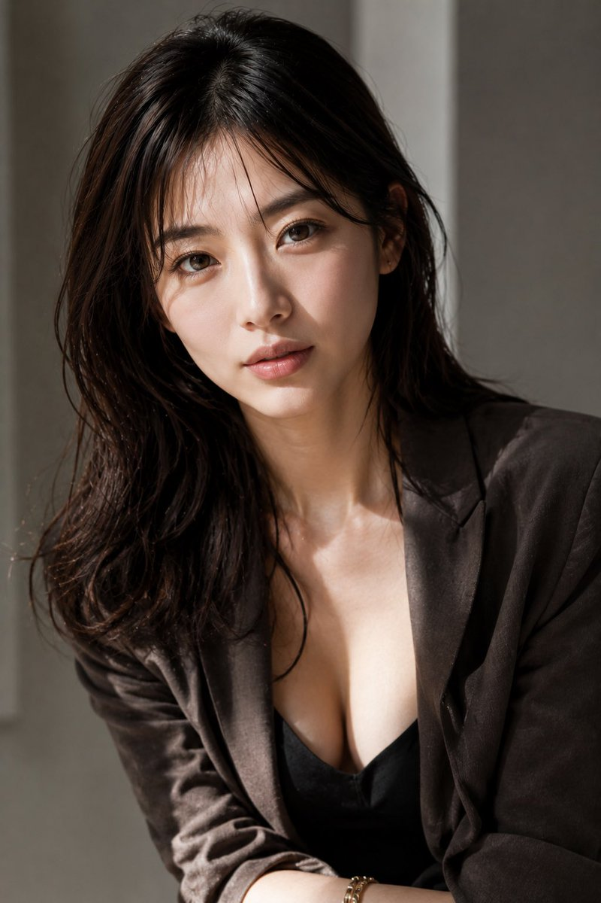

# Cinematic editorial fashion portrait template

**中文标题：** 时尚杂志风电影肖像模板  
**ID:** `gi25-gen-008` · **Mode:** `generate`  
**Categories:** `general`  
**Tags:** `portrait`, `editorial`, `toolcentral`  



### Cinematic editorial fashion portrait template

```text
Photorealistic, ultra-high-definition cinematic portrait photography.

Lighting with soft natural light. Realistic shadowing and modest fill light from a frontal reflector. Realistic skin expression including pores and fine skin texture. High-definition hair depicted down to fine strands. Physically accurate fabric texture and wrinkle expression.

Natural color grading. Realistic dynamic range. Physically accurate reflection expression.

Depiction as if taken with a full-frame camera and an 85mm portrait lens. Shallow depth of field, but sharp focus on the eyes and face. Natural bokeh expression. Delicate film grain. Realistic lens depiction.

Human body with perfectly accurate anatomical structure. No finger failure. No extra fingers. No deformed human body.

Anime style prohibited. Illustration style prohibited. Game CG style prohibited. Plastic-like skin texture prohibited. No text, logos, or watermarks.

High-end fashion magazine style editorial fashion photo. Sophisticated portrait style in the vein of Vogue.

Professional model posing. Sophisticated posture and elegant body lines. Intellectual and luxurious expression showing confidence.

Combination of studio-quality soft beauty lighting and cinematic natural lighting. Elegant highlights on skin, hair, and clothing.

Calm and luxurious color grading. Deep contrast and soft highlights.

Tailored high-fashion clothing. Quality expression of fabric, leather, and accessory textures.

Composition like a fashion magazine. Editorial layout making use of white space.

Bust-up composition of a {argument name="age" default="25-year-old"} {argument name="gender" default="Japanese woman"}, generated in a 2:3 ratio frame.
```

- **Recommended model:** `gpt-image-2.5-flare`
- **Settings:** _(defaults)_
- **Source:** [GitHub](https://github.com/Toolcentral-ai/awesome-gpt-image-2-prompts) — かみいずみさω (via Toolcentral-ai)
- **License note:** source-attributed catalog
