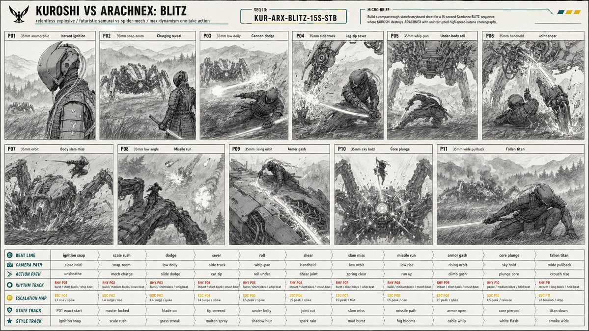

# Action Storyboard Sheet

**中文标题：** 动作分镜表  
**ID:** `gi25-x-001` · **Mode:** `generate`  
**Categories:** `ui-mockup`, `general`  
**Tags:** `x-twitter`, `evolink`, `community`, `gpt-image-2`



### Action Storyboard Sheet

```text
Create a 16:9 image.
[PROJECT CARD]
Create a compact designed masthead, not a table.
TITLE: KUROSHI VS ARACHNEX: BLITZ
META LINE: relentless explosive / futuristic samurai vs spider-mech / max-dynamism one-take action
PRIORITY: constant motion readability, one-take camera continuity, leg-cut and core-kill clarity, massive scale contrast
MICRO BRIEF: Build a compact rough-sketch storyboard sheet for a 15-second Seedance BLITZ sequence where KUROSHI destroys ARACHNEX with uninterrupted high-speed katana choreography.
[CONTINUITY HEADER]
SEQUENCE ID: KUR-ARX-BLITZ-15S-STB
REFERENCE PRIORITY: @image1 controls C1 KUROSHI identity, wardrobe, armor, helmet, cables, katana, proportions; @image2 controls C2 ARACHNEX identity, weapon layout, eight-leg structure, scale, armor; @image3 controls P01 starting-frame composition exactly; storyboard controls staging, camera sampling, movement, geography, damage continuity.
[SCENE PACKET]
PREMISE: KUROSHI erupts from a cold starting-frame profile into a relentless one-take fight, sprinting through ARACHNEX's attacks, climbing the machine, and killing it through the sensor core.
LOCATION: open Japanese mountain field at blue hour, ankle-high wind-blown grass, wet earth, ground mist, distant pine ridges, layered mountain silhouettes, wide sky, no buildings, no roads, no extra fighters.
```

- **Recommended model:** `gpt-image-2.5-sunburst`
- **Settings:** _(defaults)_
- **Source:** [X/Twitter](https://x.com/neural_aperture/status/2064048487583424581) — @neural_aperture (via EvoLinkAI)
- **License note:** CC0-1.0 (EvoLink catalog); original X post — remix with attribution
- **Notes:** Mirrored in EvoLink case 450 (comparison.md); original post on X.
