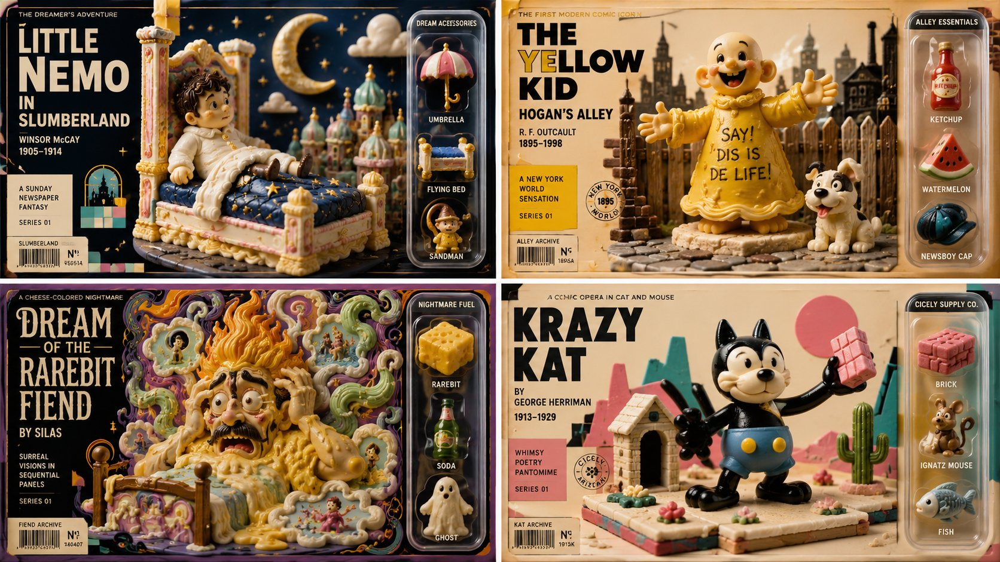

# SQL Collectible Toy Packaging Grid

**中文标题：** SQL 收藏玩具包装四宫格  
**ID:** `gi25-x-002` · **Mode:** `generate`  
**Categories:** `general`, `ui-mockup`  
**Tags:** `x-twitter`, `evolink`, `community`, `gpt-image-2`



### SQL Collectible Toy Packaging Grid

```text
SELECT * FROM Collectible_Toy_Packaging  WHERE layout_format = '2x2_Quadrant_Grid' AND targets = ARRAY['[IP_1]', '[IP_2]', '[IP_3]', '[IP_4]'] AND quadrant_structure = ARRAY[     (Zone: 'Left_Column', Material: 'Printed_Cardboard', Content: 'Massive_Typography_Title_And_Inferred_Creator_Metadata'),     (Zone: 'Center_Stage', Material: 'confection candy', Content: 'infer_main_character_and_diorama(target)'),      (Zone: 'Right_Column', Material: 'Transparent_Glossy_Vacuum_Plastic_Blister_Pack', Content: 'infer_three_iconic_props(target)_As_3D_Miniatures_With_Text_Labels') ] AND color_grading = 'Vintage_Retro_Palette_Matching_Inferred_IP_Era' AND camera = 'Product_Photography_Front_Orthographic_View';
```

- **Recommended model:** `gpt-image-2.5-sunburst`
- **Settings:** _(defaults)_
- **Source:** [X/Twitter](https://x.com/Gdgtify/status/2063254078269137330) — @Gdgtify (via EvoLinkAI)
- **License note:** CC0-1.0 (EvoLink catalog); original X post — remix with attribution
- **Notes:** Mirrored in EvoLink case 445 (comparison.md); original post on X.
