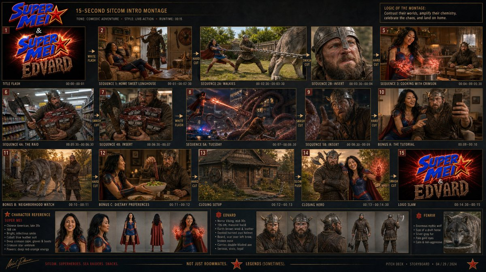

# Sitcom Intro Storyboard Sheet

**中文标题：** 情景喜剧片头分镜表  
**ID:** `gi25-x-006` · **Mode:** `generate`  
**Categories:** `ui-mockup`, `general`  
**Tags:** `x-twitter`, `evolink`, `community`, `gpt-image-2`



### Sitcom Intro Storyboard Sheet

```text
Create a professional film production storyboard for a 15-second sitcom intro montage in a premium pitch deck presentation. Use multi-panel storyboard sheet layout, cinematic 16:9 framing per panel, clean panel borders, shot descriptions beneath each frame, timing notes, and transition indicators between panels. Maintain strict character consistency for Super Mei, Edvard, and Fenrir across all panels. Include a complete sequence of title flash, living room, backyard walkies, kitchen powers, convenience store raid, monster battle, bonus domestic comedy beats, closing hero shot, and logo slam. Visual style: cinematic sitcom, high-budget live-action network comedy, production-ready fidelity, not animated or illustrated.
```

- **Recommended model:** `gpt-image-2.5-sunburst`
- **Settings:** _(defaults)_
- **Source:** [X/Twitter](https://x.com/KimAkiyama81/status/2059390326578511931) — @KimAkiyama81 (via EvoLinkAI)
- **License note:** CC0-1.0 (EvoLink catalog); original X post — remix with attribution
- **Notes:** Mirrored in EvoLink case 393 (ui.md); original post on X.
