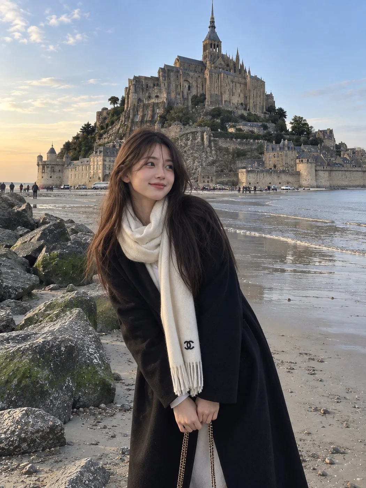

# Coastal abbey travel portrait

**中文标题：** 海岸修道院旅行人像  
**ID:** `gi25-x-027` · **Mode:** `generate`  
**Categories:** `general`  
**Tags:** `x-twitter`, `community`, `gpt-image-2.5`, `liuyaanng`



### Coastal abbey travel portrait

```text
GPT image 2.5 on chatgpt

Prompt

A photorealistic candid travel portrait of a young East Asian woman standing on a quiet sandy shoreline beside large moss-covered rocks, with a magnificent historic stone abbey and medieval castle-like architecture rising dramatically on a rocky island behind her. She has long straight dark brown hair falling naturally over one shoulder, soft youthful facial features, and a gentle warm smile while looking directly at the camera.

She is wearing a long oversized black coat with her hands casually tucked inside the pockets, layered over a light-colored outfit. A large soft cream-white scarf is wrapped warmly around her neck, hanging down the front with a small black designer-style emblem near the end. A delicate chain shoulder bag is partially visible.

The composition captures her in the foreground while the vast historic abbey dominates the background, surrounded by ancient stone walls, rocky cliffs, sandy tidal flats, and a calm coastal atmosphere. A few small distant vehicles and people add realistic scale to the scene. Soft natural evening light and a clear pale blue sky create a peaceful European travel mood.

Ultra-realistic photography, authentic candid travel photo, natural skin texture, realistic fabric details, soft cinematic lighting, subtle smartphone camera aesthetic, slightly dreamy color grading, natural proportions, detailed architecture, peaceful coastal atmosphere, vertical composition, 3:4 aspect ratio.
```

- **Recommended model:** `either`
- **Settings:** _(defaults)_
- **Source:** [X/Twitter](https://x.com/saniaspeaks_/status/2097532595814940683) — @saniaspeaks_ (via liuyaanng/awesome-gpt-image-2.5)
- **License note:** Community X post mirrored in awesome-gpt-image-2.5; remix with attribution
- **Notes:** Community X prompt #060 (portrait photography) curated in liuyaanng/awesome-gpt-image-2.5 docs/prompts/community-x.md; original on X.
