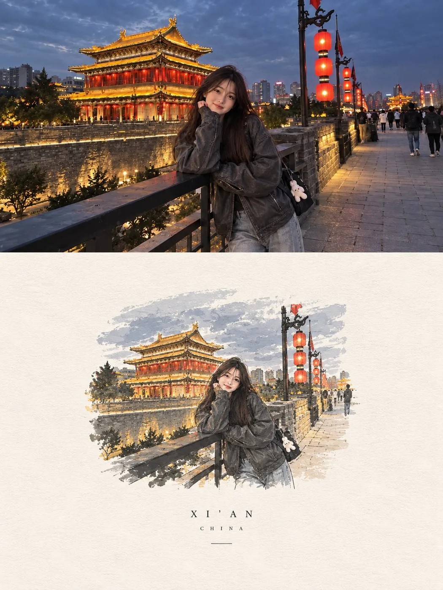

# Night city-wall travel portrait

**中文标题：** 夜城墙旅行人像  
**ID:** `gi25-x-028` · **Mode:** `generate`  
**Categories:** `general`  
**Tags:** `x-twitter`, `community`, `gpt-image-2.5`, `liuyaanng`



### Night city-wall travel portrait

```text
GPT image 2.5

Prompt:
A realistic candid travel photo of a young East Asian woman standing on an old stone walkway beside a historic city wall at night. Behind her is a beautiful traditional Chinese-style building glowing with warm golden lights and deep red accents, with layered roofs, curved upturned eaves, detailed wooden architecture, and softly illuminated windows. Tall red lanterns hang from an ornate black lamp post nearby, adding a warm glow to the scene.
She has long, straight dark brown hair falling naturally over her shoulders and back, with a few loose strands around her face. She has soft youthful features and a gentle, genuine smile as she looks naturally toward the camera. She is wearing an oversized dark charcoal-gray leather jacket with a relaxed, slightly loose fit, paired with wide-leg light-gray jeans. A small black shoulder bag hangs at her side with a cute little white plush charm attached to it.
She is casually leaning against the black metal railing, resting one arm comfortably on it while her body is turned slightly toward the camera. The pose should feel spontaneous and relaxed, like a friend captured the moment while she was enjoying an evening walk. The old dark brick wall stretches behind her, with warm lights highlighting parts of the stonework, while the paved walkway continues into the distance with a few people and subtle city lights.
The sky is a deep gray-blue with soft clouds, contrasting naturally with the warm golden architecture and glowing red lanterns. Keep everything believable and lived-in, with realistic skin texture, natural facial proportions, individual hair strands, authentic leather and denim textures, soft evening shadows, subtle reflections from the lights, and realistic depth of field. Shot with a modern smartphone camera, slightly imperfect and natural rather than overly polished, with soft cinematic tones and a subtle dreamy atmosphere. Wide horizontal 16:9 composition.
```

- **Recommended model:** `either`
- **Settings:** _(defaults)_
- **Source:** [X/Twitter](https://x.com/Aqsahere_/status/2097693634569396706) — @Aqsahere_ (via liuyaanng/awesome-gpt-image-2.5)
- **License note:** Community X post mirrored in awesome-gpt-image-2.5; remix with attribution
- **Notes:** Community X prompt #061 (portrait photography) curated in liuyaanng/awesome-gpt-image-2.5 docs/prompts/community-x.md; original on X.
