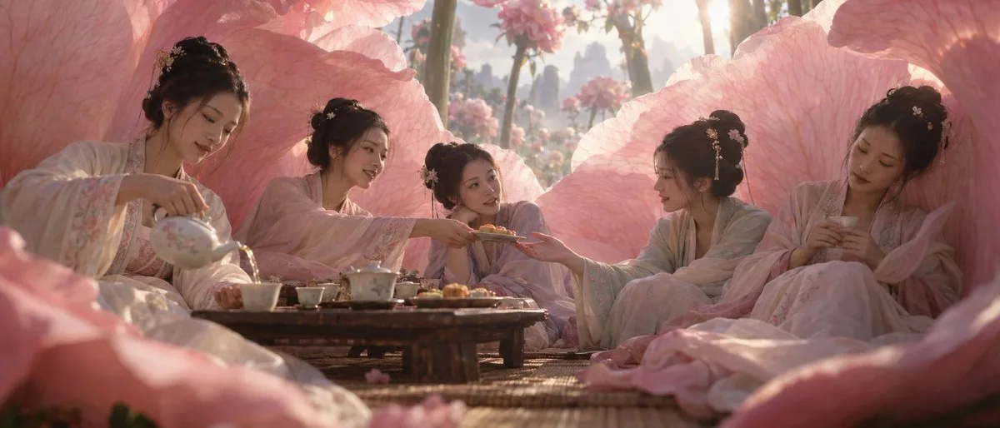

# Tea party inside a giant peony

**中文标题：** 巨型牡丹内的茶会  
**ID:** `gi25-x-030` · **Mode:** `generate`  
**Categories:** `general`  
**Tags:** `x-twitter`, `community`, `gpt-image-2.5`, `liuyaanng`



### Tea party inside a giant peony

```text
ChatGPT Images 2.5 这质感，还要啥 midjourney 啊！

prompt 👇

A cinematic wide anamorphic still photograph capturing an intimate floral interior — five miniature young adult Chinese women seated together inside the hollow of an enormous blooming pale-pink peony, its broad curved petals curling upward and outward to form an open floral hall that dominates the frame while all five seated figures remain clearly visible, the camera held at a low, near-eye-line position just above the tea table so the towering petal walls rise dramatically around the group, the composition intimate, unhurried, and quietly domestic.

The five women wear pale silk robes in the ancient Chinese style, soft ivory and blush tones with delicate embroidered hems, their hair swept into simple upswept styles set with delicate hairpins that catch small glints of light. They sit and lean around a low wooden tea table resting on a woven bamboo mat, white porcelain teaware and small pastries arranged between them. One woman pours tea in a steady unhurried pour, the pale liquid catching light as it falls. Beside her, a second woman offers a pastry across the table toward her neighbor, who reaches out with an open hand to accept it, her fingers just meeting the plate's edge. A fourth woman leans in slightly, lips parted mid-conversation, her gaze soft and warm toward the group. The fifth rests her shoulder against the curve of a petal wall, a teacup held loosely in both hands, her eyes lowered in quiet listening. All five wear relaxed, natural poses, their gazes drifting between each other in unforced, overlapping moments of attention.

The peony's interior surrounds them in soft translucent walls — fine branching veins visible through the petal flesh, the edges glowing faintly where afternoon light passes through, the curling petal lips forming a natural open ceiling above the group. Beyond one open gap in the petal wall, the towering stems and stalks of the wider garden rise into view, distant blossoms softening into pale mist and atmospheric haze at the edge of visibility, the miniature world reading as vast and self-contained.

A gentle breeze moves through the floral hall, lifting the edge of a silk scarf, stirring the fine hairs at a hairline, curling the thin ribbon of steam rising from the teapot's spout, and trembling faintly along the petal edges without disturbing the stillness of the seated group. Soft afternoon light filters down through the petal canopy, warm pink bounce light gathering across the near sides of the women's faces and the pale wood of the table, cool lavender shadow settling into the folds of fabric and the deeper recesses between petals where the light doesn't reach.

Captured with a wide-latitude cinema look and a vintage 2x anamorphic character at a wide aperture — gentle oval bokeh on the distant garden stems, soft frame-edge falloff, a light diffusion bloom lifting the brightest petal edges into a soft halation, color-negative daylight film rendition with fine 35mm grain, in an M1 cinematic narrative register. Real photographic frame captured on a real cinema camera, real anamorphic lens, real silk, real porcelain, real human faces and anatomy — no CGI, no rendered look, no digital cleanliness, no plastic surfaces, no AI smoothness, no skin smoothing, no doll-like faces, no waxy sheen.
```

- **Recommended model:** `gpt-image-2.5-sunburst`
- **Settings:** _(defaults)_
- **Source:** [X/Twitter](https://x.com/johnAGI168/status/2097523873059147957) — @johnAGI168 (via liuyaanng/awesome-gpt-image-2.5)
- **License note:** Community X post mirrored in awesome-gpt-image-2.5; remix with attribution
- **Notes:** Community X prompt #059 (scenes illustration) curated in liuyaanng/awesome-gpt-image-2.5 docs/prompts/community-x.md; original on X.
