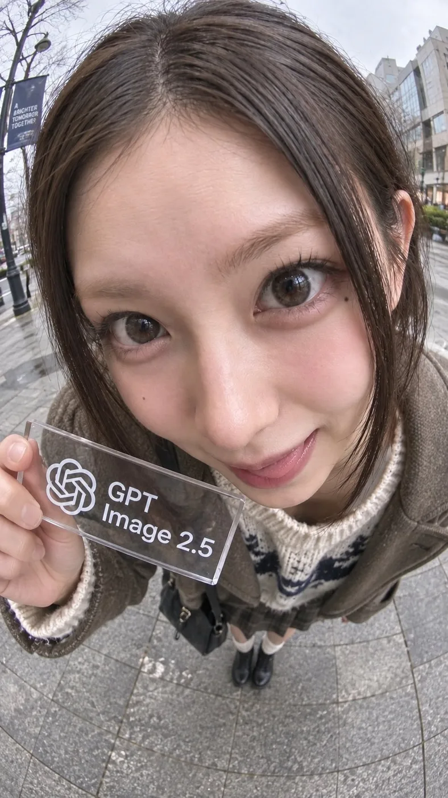

# Extreme fisheye close-up selfie

**中文标题：** 极端鱼眼近距离自拍  
**ID:** `gi25-x-074` · **Mode:** `generate`  
**Categories:** `general`  
**Tags:** `x-twitter`, `community`, `gpt-image-2.5`, `liuyaanng`, `fisheye`, `selfie`



### Extreme fisheye close-up selfie

```text
超広角フィッシュアイレンズによる極端な近接撮影。カメラを顔のすぐ目の前、わずかに上方に置き、人物がレンズへ顔を強く近づけている。

顔が画面全体の約85〜95%を占める極端な顔面クローズアップ。額、目、鼻、頬、口が画面の大部分を埋め、フィッシュアイ特有の強い遠近感によって、レンズに近い顔が大きく、奥に離れるほど急激に小さく見える。

頭部から胴体へ向かって強くパースが縮み、肩、腕、胴体、脚は画面下側へ向かって極端に小さく収束する。身体は主役ではなく、画面最下部に小さく写り込む程度。大きな顔の直下から、小さな身体が奥へ続いて見える構図。

真正面の平面的なポートレートではなく、顔と身体のスケール差が非常に大きい誇張遠近。レンズ周辺は自然に湾曲し、背景の壁や直線もフィッシュアイによって弧を描く。画面端には軽い魚眼レンズ特有の歪み。

人物はカメラを覗き込むように少し前傾し、自然で楽しそうな表情。顔の向きと視線はわずかに非対称にする。

顔を最大限大きく見せ、身体を画面下部に極端に小さく見せる。
通常のバストアップ、通常のセルフィー距離、均一な身体比率は禁止。レンズの枠なし
```

- **Recommended model:** `gpt-image-2.5-sunburst`
- **Settings:** _(defaults)_
- **Source:** [X/Twitter](https://x.com/SDT_side/status/2097408563648016835) — @SDT_side (via liuyaanng/awesome-gpt-image-2.5)
- **License note:** Community X post mirrored in awesome-gpt-image-2.5; remix with attribution
- **Notes:** Community X prompt #072 (portrait photography) curated in liuyaanng/awesome-gpt-image-2.5; same thread may hold multiple prompts; original on X.
