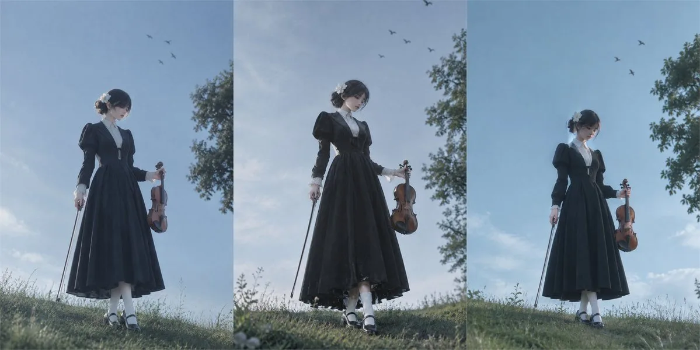

# Cool-teal soft-focus violinist portrait

**中文标题：** 冷青柔焦小提琴手写真  
**ID:** `gi25-x-078` · **Mode:** `generate`  
**Categories:** `general`  
**Tags:** `x-twitter`, `community`, `gpt-image-2.5`, `liuyaanng`, `portrait`, `soft-focus`



### Cool-teal soft-focus violinist portrait

```text
低饱和冷青调、轻微柔焦、哑光平滑、细颗粒、低对比的真人摄影全身写真；一位年轻女性站在草坡上，略低机位仰拍，全身入镜，主体居中偏下，天空大面积留白，右侧树冠与上方飞鸟形成平衡。她身形纤细修长，冷白偏粉肤调，黑色长袖长裙配白色内衬与翻领，袖口有细腻蕾丝感，一手提着小提琴，一手自然握琴弓，短黑发低盘，侧边白花发饰，白袜黑鞋；头部微低垂并轻侧，眼神下垂，嘴唇轻抿，表情安静、若有所思，皮肤和发丝有柔和自然高光，背景为简洁开阔的蓝天与草地，整体保持真实光影、细腻质感和轻电影感，避免夸张大笑、过度锐化、完整正脸特写
```

- **Recommended model:** `gpt-image-2.5-sunburst`
- **Settings:** _(defaults)_
- **Source:** [X/Twitter](https://x.com/alanblogsooooo/status/2097599984879440341) — @alanblogsooooo (via liuyaanng/awesome-gpt-image-2.5)
- **License note:** Community X post mirrored in awesome-gpt-image-2.5; remix with attribution
- **Notes:** Community X prompt #056 (portrait) curated in liuyaanng/awesome-gpt-image-2.5; prompt text verified from media ALT on the original X post; original on X.
