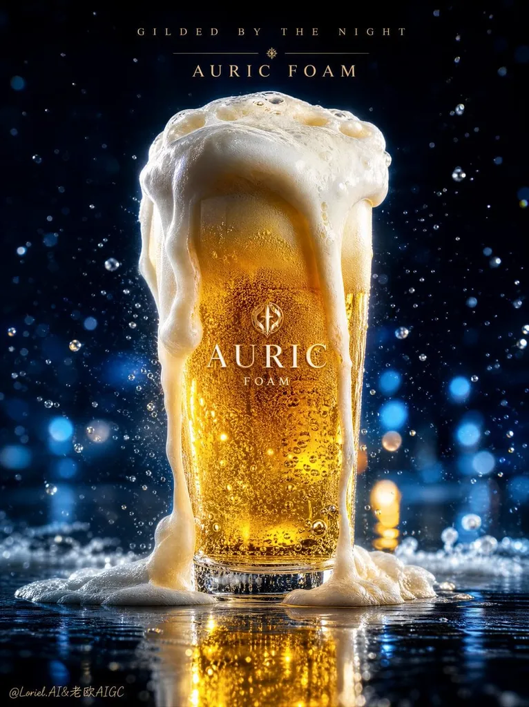

# Beer with Dense Foam Crown

**中文标题：** 厚泡沫溢出的啤酒特写  
**ID:** `gi25-x-085` · **Mode:** `generate`  
**Categories:** `general`  
**Tags:** `x-twitter`, `community`, `gpt-image-2.5`, `renoise`, `style-&-intelligence`, `en`

### Beer with Dense Foam Crown

```text
a dense foam crown spilling in two uneven, heavy cascades while the glass rim stays visibly sharp
The foam feels pressurized and creamy, but the silhouette still reads as a clean, premium pint glass.
```

- **Recommended model:** `gpt-image-2.5-sunburst`
- **Settings:** _(defaults)_
- **Source:** [community](https://x.com/ou_zhen599/status/2097658492459135054) — @ou_zhen599 (via renoise-ai/awesome-gpt-image-2-5-prompts)
- **License note:** Community X post mirrored in renoise-ai/awesome-gpt-image-2-5-prompts; remix with attribution
- **Notes:** Community X prompt curated in renoise-ai/awesome-gpt-image-2-5-prompts (beer-with-dense-foam-crown); original on X; published 2026-09-09.



