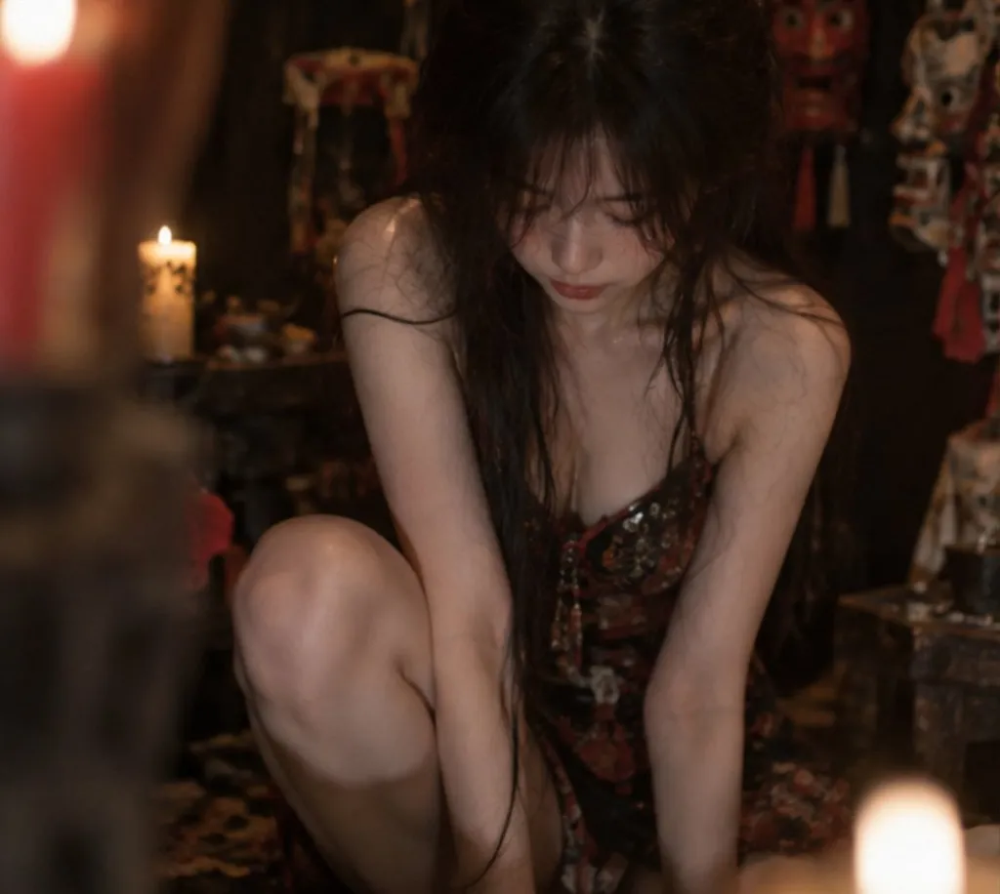

# Portrait in Ancient Chinese Ritual Shrine

**中文标题：** 傩面具古祠堂人像  
**ID:** `gi25-x-102` · **Mode:** `generate`  
**Categories:** `general`  
**Tags:** `x-twitter`, `community`, `gpt-image-2.5`, `renoise`, `style-intelligence`, `en`

### Portrait in Ancient Chinese Ritual Shrine

```text
9:16 photorealistic cinematic portrait of an adult East Asian woman inside a dark ancient Chinese ritual shrine, surrounded by old Nuo masks, candles, carved wooden altar objects and deep red decorations.
```

- **Recommended model:** `gpt-image-2.5-sunburst`
- **Settings:** _(defaults)_
- **Source:** [community](https://x.com/nicebabycat/status/2096779399899328788) — @韦小宝 (via renoise-ai/awesome-gpt-image-2-5-prompts)
- **License note:** Community X post mirrored in renoise-ai/awesome-gpt-image-2-5-prompts; remix with attribution
- **Notes:** Community X prompt curated in renoise-ai/awesome-gpt-image-2-5-prompts (portrait-in-ancient-chinese-ritual-shrine); original on X; published 2026-09-07.



