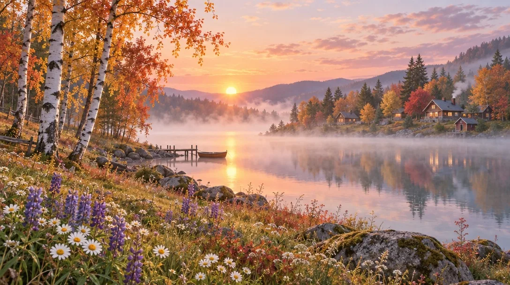

# Misty Autumn Lakeside at Sunrise

**中文标题：** 雾气秋日湖畔日出  
**ID:** `gi25-x-150` · **Mode:** `generate`  
**Categories:** `general`  
**Tags:** `x-twitter`, `community`, `gpt-image-2.5`, `seeapi`, `en`



### Misty Autumn Lakeside at Sunrise

```text
A tranquil, pastel-toned landscape featuring a serene lakeside at sunrise, with soft mist hovering over the water. In the foreground, a vibrant meadow filled with wildflowers such as daisies and lupines leads to a cluster of birch trees with autumn-colored leaves. Across the misty lake, cozy wooden cottages nestle among more colorful trees, all bathed in the gentle, warm glow of the rising sun. The overall style is dreamy and delicate, evoking a peaceful, nostalgic mood.
```

- **Recommended model:** `gpt-image-2.5-sunburst`
- **Settings:** _(defaults)_
- **Source:** [community](https://x.com/churvikv/status/2099793774700376379) — @churvikv (via SeeAPI/awesome-gpt-image-2.5-prompts)
- **License note:** Community X post mirrored in SeeAPI/awesome-gpt-image-2.5-prompts; remix with attribution
- **Notes:** SeeAPI P48
