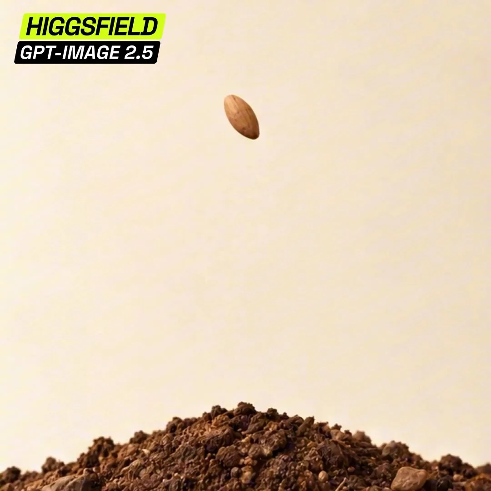

# Stop-Motion Clay Cosmos Reference Photo

**中文标题：** 定格黏土宇宙参考照  
**ID:** `gi25-x-158` · **Mode:** `generate`  
**Categories:** `general`  
**Tags:** `x-twitter`, `community`, `gpt-image-2.5`, `phimaker`, `en`



### Stop-Motion Clay Cosmos Reference Photo

```text
Create one square stop-motion reference photo, not a storyboard: a handmade matte-clay coral-pink cosmos flower in dark brown soil against a warm cream backdrop. Locked straight-on low camera, 70mm macro, orthographic feel. Soil fills the bottom 22%, peaking at (50%,79%); the centered stem runs from (50%,80%) to the flower center at (50%,33%). Add exactly two green leaves and a 35%-wide flower head with exactly 10 coral petals and a textured golden center. Include subtle fingerprints, soil crumbs, and a few pebbles. Use soft upper-left lighting and fixed shadows. Keep the full flower visible, with the camera and soil stationary for animation. No pot, extra plants, characters, insects, hands, text, watermark, border, or grid.
```

- **Recommended model:** `gpt-image-2.5-sunburst`
- **Settings:** _(defaults)_
- **Source:** [community](https://x.com/higgsfield_ai/status/2097475914124967955) — @higgsfield_ai (via PhiMaker5/awesome-gpt-image-2.5-prompts)
- **License note:** Community X post mirrored in PhiMaker5/awesome-gpt-image-2.5-prompts; remix with attribution
- **Notes:** PhiMaker id=111; published 2026-09-09; source_verified=True.
