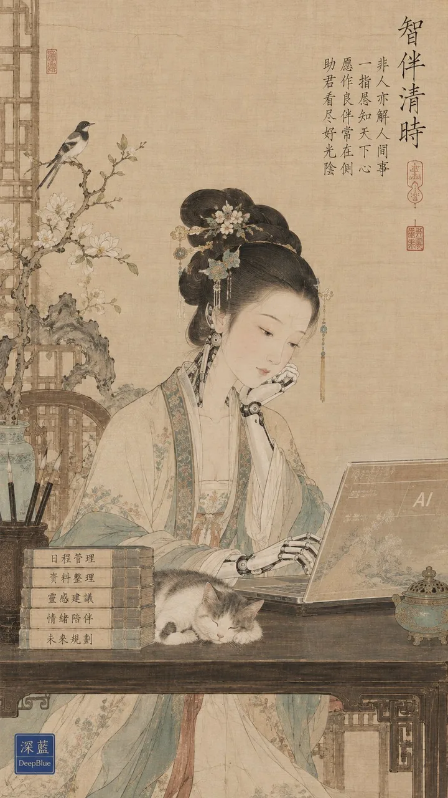

# Song Dynasty Gongbi Swap-the-Subject Formula

**中文标题：** 宋徽宗工笔 × 离谱主体：古画换主角通用公式  
**ID:** `gi25-x-167` · **Mode:** `generate`  
**Categories:** `general`, `character-consistency`  
**Tags:** `x-twitter`, `community`, `gpt-image-2.5`, `xianyu`, `zh`



### Song Dynasty Gongbi Swap-the-Subject Formula

```text
宋徽宗审美 × 宋代院体工笔 × 【超现实主体】 × 极致工笔细节 × 瘦金体题诗 × 朱文钤印 × 宋式留白 × 古画绢本肌理 × 左下角钤盖「深蓝」在上、「DeepBlue」在下的深蓝色篆刻方印

用法：只换【超现实主体】，古画审美完全不变。越不该出现在宋代，反差越大越好。
例：霸王龙 / 宇宙飞船 / AI机器人秘书 / 抹香鲸 / DNA / 太阳系
生成：GPT Image 2.5
```

- **Recommended model:** `gpt-image-2.5-sunburst`
- **Settings:** _(defaults)_
- **Source:** [community](https://x.com/DeepBlueX0/status/2100761021413802212) — @DeepBlueX0 (via xianyu110/awesome-gpt-image2.5)
- **License note:** Community X post mirrored in xianyu110/awesome-gpt-image2.5; remix with attribution
- **Notes:** xianyu110/awesome-gpt-image2.5 case 2100761021413802212; category=场景视觉.
