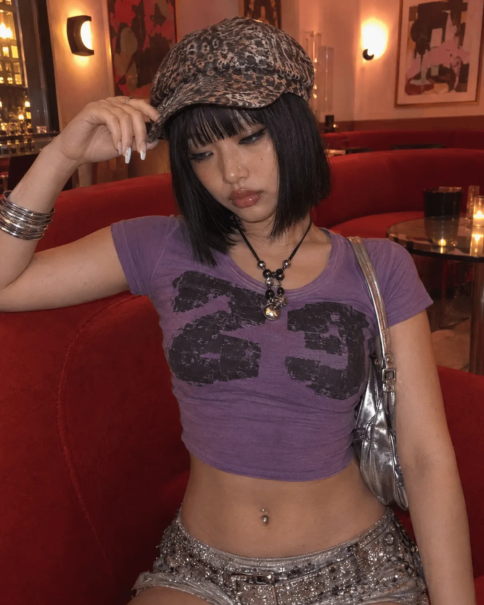

# Y2K Lounge Fashion Portrait

**中文标题：** Y2K 休息室时尚人像  
**ID:** `gi25-x-175` · **Mode:** `generate`  
**Categories:** `general`  
**Tags:** `reddit`, `community`, `gpt-image-2.5`, `seeapi`, `en`



### Y2K Lounge Fashion Portrait

```text
A candid photo of a young East Asian woman taken by someone else at a natural eye-level angle, seated indoors in a stylish warm-toned lounge/bar, framed from the hips up. She poses with one hand raised to touch the brim of her hat, elbow out, head tilted down and slightly to the side with a cool, sultry, pouty expression, eyes half-lowered, glossy lips. She has a sleek jet-black chin-length bob with blunt straight bangs falling over her forehead and eyes, and wears a soft snakeskin/leopard-print newsboy baker-boy cap.The outfit is a Y2K-inspired look: a fitted purple short-sleeve crop tee with a large bold black graphic number print on the chest (generic numerals, no logos), exposing her midriff with a navel piercing, paired with a low-rise rhinestone-embellished belt/skirt in silver. She wears a chunky beaded pendant cord necklace with grey and white beads, stacked chunky silver bangles on one wrist, long pale-tipped nails, and carries a metallic silver shoulder bag on a thin strap. The background is a warm, dimly lit retro interior — a curved bright-red sofa, a glass table, abstract framed art on the walls, glowing wall lights and a warm peachy-pink glow, softly out of focus. Warm ambient indoor lighting, soft shadows, moody stylish lounge atmosphere.Camera & texture: Shot on iPhone (rear camera) indoors, authentic candid smartphone photo, fine sensor grain and digital noise, warm indoor color cast, natural smartphone dynamic range with soft highlights, slight softness, no filter.Skin realism (critical): Highly detailed true-to-life human skin that looks real, never waxy, never plastic, never smooth or CGI-like. Skin shows natural imperfections — visible pores across the nose, cheeks and forehead, fine peach-fuzz vellus hairs, subtle uneven skin tone, faint freckles and small beauty marks, a few tiny blemishes and natural warmth, soft under-eye texture with real fine lines, a natural soft sheen on the cheekbones, nose, midriff and arms with matte areas
```

- **Recommended model:** `gpt-image-2.5-sunburst`
- **Settings:** _(defaults)_
- **Source:** [community](https://www.reddit.com/r/ImagineAiArt/comments/1wi79wi/gpt_image_25_flare_is_this_actually_the_best_ai/) — u/imagine_ai (via SeeAPI/awesome-gpt-image-2.5-prompts)
- **License note:** Community Reddit post mirrored in SeeAPI/awesome-gpt-image-2.5-prompts; remix with attribution
- **Notes:** SeeAPI P70 (p70-y2k-lounge-fashion-portrait)
