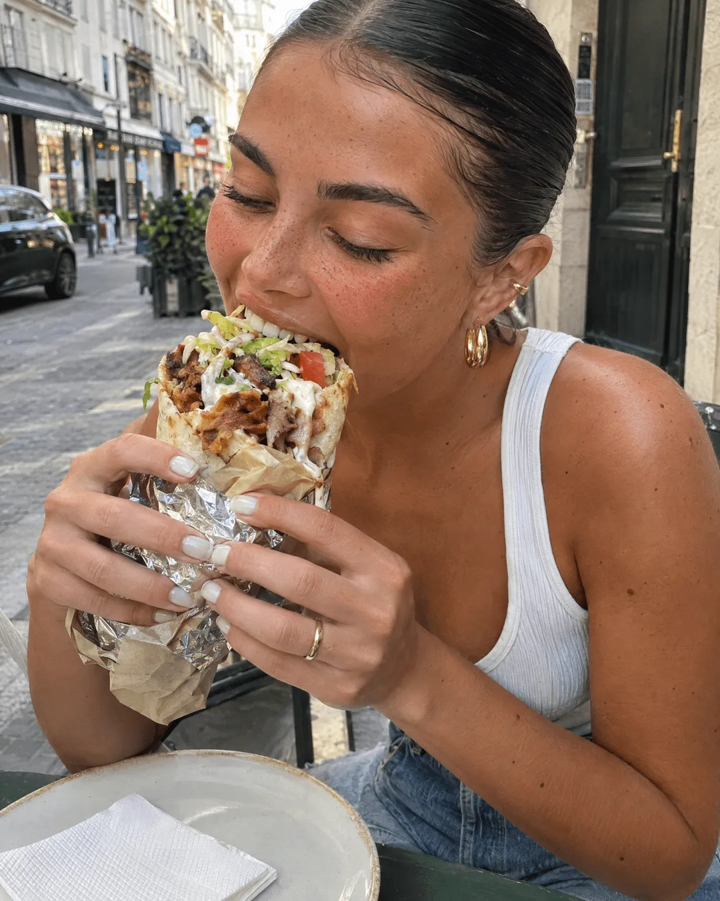

# Candid Street-Food Bite

**中文标题：** 街头大口吃烤肉卷抓拍  
**ID:** `gi25-x-176` · **Mode:** `generate`  
**Categories:** `general`  
**Tags:** `reddit`, `community`, `gpt-image-2.5`, `seeapi`, `en`



### Candid Street-Food Bite

```text
A candid photo of a young woman taken by someone else, seated at a small round outdoor café table on a city street, leaning down and forward with her mouth open wide about to take a big bite of a loaded kebab/gyro wrap held in both hands, wrapped in foil and white paper. Her eyes are lightly closed and her expression is joyful and eager mid-bite — a fun, unposed, real candid moment. She has dark hair slicked back tightly into a sleek low bun/ponytail, with small face-framing baby hairs, wearing gold ear-cuff and chunky gold hoop/drop earrings. Her makeup is soft and natural with defined brows and a glossy lip, and she has a natural sun-kissed complexion with light freckles and beauty marks across her shoulders and chest.

She wears a yellow ribbed strappy tank top and denim jeans, with pale neutral manicured nails and a gold ring. On the table is a beige speckled ceramic plate, a folded stack of yellow and teal paper napkins, and a pair of folded sunglasses. The overloaded wrap is in sharp focus — pita/flatbread stuffed with shaved döner meat, crispy fried pieces, fresh green lettuce, tomato and sauces.

Warm, bright, natural daytime light on a European city street, soft natural shadows. The background shows a blurred street scene — a parked car, shopfronts with signage, a doorway and pavement, all softly out of focus.

Facial structure: Youthful oval face with defined cheekbones, full lips, strong groomed brows, a straight nose, and a warm sun-kissed complexion.

Camera & realism: Shot on a phone rear camera, natural candid perspective. Authentic smartphone photo quality — subtle grain, true-to-life warm color, natural dynamic range, no heavy filter. Highly realistic skin with visible natural texture — pores, freckles and beauty marks on the shoulders and face, soft peach-fuzz, subtle unevenness and a natural sheen from the daylight — so it reads as a real candid photo rather than retouched or airbrushed. Shallow natural depth of field with the wrap and face sharpest, background blurred. Warm, fun, spontaneous street-food mood
```

- **Recommended model:** `gpt-image-2.5-sunburst`
- **Settings:** _(defaults)_
- **Source:** [community](https://www.reddit.com/r/ImagineAiArt/comments/1wi79wi/gpt_image_25_flare_is_this_actually_the_best_ai/) — u/imagine_ai (via SeeAPI/awesome-gpt-image-2.5-prompts)
- **License note:** Community Reddit post mirrored in SeeAPI/awesome-gpt-image-2.5-prompts; remix with attribution
- **Notes:** SeeAPI P71 (p71-candid-street-food-bite)
