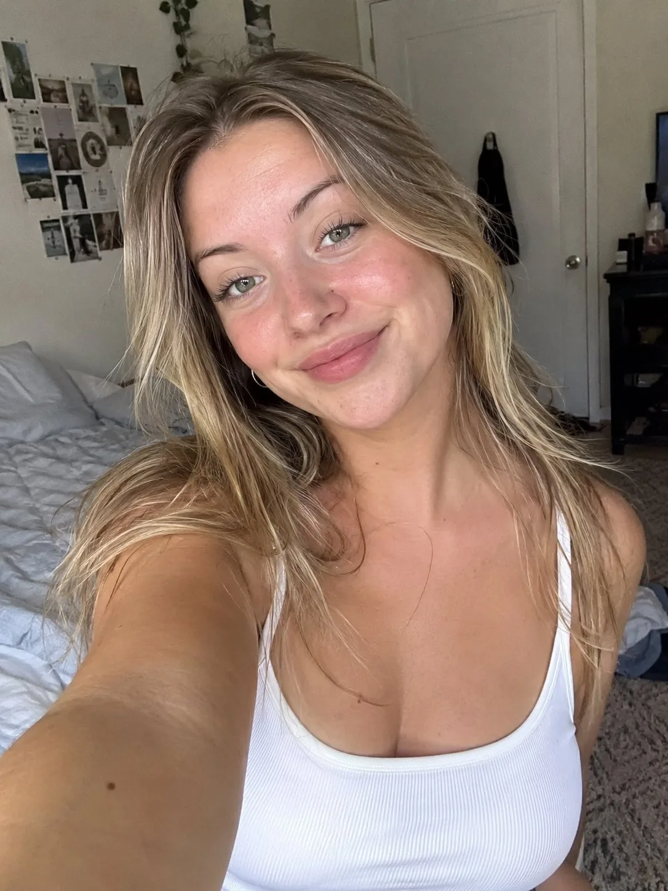

# Natural Bedroom UGC Selfie

**中文标题：** 自然卧室 UGC 自拍  
**ID:** `gi25-x-182` · **Mode:** `generate`  
**Categories:** `general`  
**Tags:** `x-twitter`, `community`, `gpt-image-2.5`, `seeapi`, `en`



### Natural Bedroom UGC Selfie

```text
{
  "prompt_type": "photorealistic_female_ugc",

  "subject": {
    "person": "white adult woman in her 20s",
    "appearance": "naturally attractive, relatable and approachable",
    "expression": "genuine, spontaneous and natural",
    "body_language": "relaxed and unposed",
    "skin": "realistic fair-to-light skin with visible pores, natural texture and subtle imperfections"
  },

  "scene": {
    "environment": "realistic everyday setting",
    "background": "lived-in environment with natural details and subtle imperfections",
    "atmosphere": "casual, personal and unstaged"
  },

  "clothing": {
    "style": "casual everyday clothing",
    "appearance": "modern, comfortable and relatable",
    "texture": "realistic fabric folds and wrinkles",
    "branding": "no visible logos or recognizable brands"
  },

  "hair": {
    "style": "natural contemporary hairstyle",
    "texture": "realistic individual strands",
    "appearance": "slightly imperfect and naturally arranged"
  },

  "camera": {
    "device": "modern smartphone",
    "perspective": "natural smartphone perspective",
    "framing": "medium close-up or medium shot",
    "composition": "slightly imperfect handheld framing",
    "focus": "natural smartphone autofocus",
    "image_quality": "high-resolution smartphone photography",
    "lens": "natural smartphone wide-angle lens"
  },

  "lighting": {
    "source": "natural available light",
    "quality": "soft and realistic",
    "shadows": "natural directional shadows",
    "avoid": [
      "studio lighting",
      "professional beauty lighting",
      "dramatic cinematic lighting"
    ]
  },

  "ugc_characteristics": {
    "authenticity": "extremely high",
    "style": "raw, casual, spontaneous and relatable",
    "camera_feel": "handheld smartphone capture",
    "commercial_feel": "minimal",
    "social_media_feel": "native to TikTok and Instagram",
    "imperfections": "subtle natural imperfections in framing, lighting and environment"
  },

  "realism": {
    "skin": "photorealistic",
    "anatomy": "accurate human anatomy",
    "hands": "realistic hands and fingers"
  },

  "negative_prompt": [
    "product",
    "product packaging",
    "logos",
    "brand names",
    "advertisement",
    "commercial photography",
    "studio photography",
    "fashion editorial",
    "CGI",
    "3D render",
    "cartoon",
    "anime",
    "plastic skin",
    "waxy skin",
    "unrealistic anatomy",
    "extra fingers",
    "deformed hands",
    "text",
    "captions",
    "watermarks",
    "graphics",
    "artificial posing"
  ],

  "final_generation_instruction": "Generate a single photorealistic UGC-style image of a white adult woman that looks like an authentic smartphone capture for TikTok or Instagram. Make her feel like a real creator rather than a model. Prioritize natural facial expression, realistic skin texture, believable anatomy, casual clothing, natural lighting, imperfect handheld framing and a lived-in environment. The final image should feel spontaneous, relatable and native to social media. Do not include any product, brand, logo, advertisement graphics or commercial elements."
}
```

- **Recommended model:** `gpt-image-2.5-sunburst`
- **Settings:** _(defaults)_
- **Source:** [community](https://x.com/Daniloecom/status/2101403775164674440) — @Daniloecom (via SeeAPI/awesome-gpt-image-2.5-prompts)
- **License note:** Community X post mirrored in SeeAPI/awesome-gpt-image-2.5-prompts; remix with attribution
- **Notes:** SeeAPI P77 (p77-natural-bedroom-ugc-selfie)
