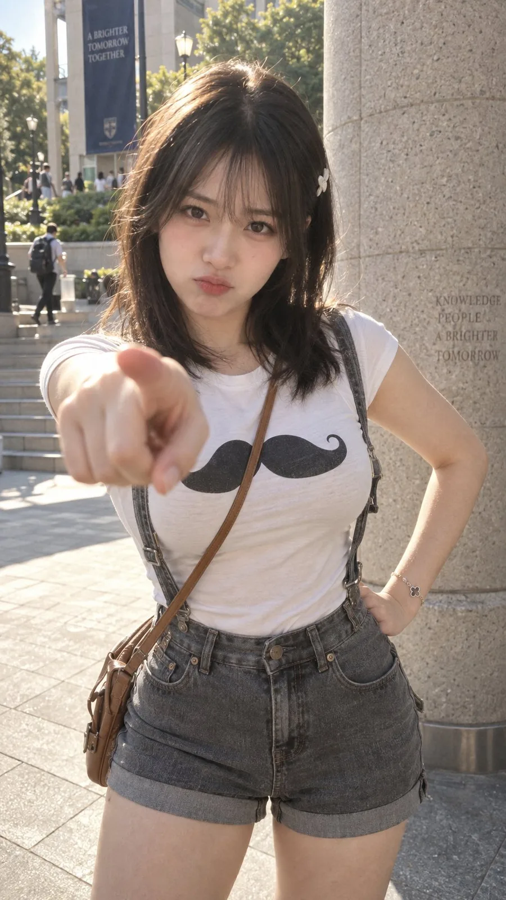

# Playful Plaza Finger Point Portrait

**中文标题：** 广场俏皮指向镜头人像  
**ID:** `gi25-x-186` · **Mode:** `generate`  
**Categories:** `general`  
**Tags:** `x-twitter`, `community`, `gpt-image-2.5`, `seeapi`, `en`



### Playful Plaza Finger Point Portrait

```text
A cinematic candid 35mm street photograph captured on location — an engaging medium hero composition of an exceptionally attractive 20-year-old East Asian collegiate woman on a sunlit urban plaza, the camera positioned straight-on at chest level capturing her breathtaking youthful beauty and playful charm as she points her right index finger teasingly directly toward the camera lens in an M1 cinematic narrative register.

The woman is a strikingly gorgeous 20-year-old young adult with refined, sweet East Asian facial features, soft radiant cheeks with a delicate peach flush, and large, captivating dark almond eyes gazing directly into the lens. Her soft, plump rose-tinted lips are pressed into an adorable, subtle micro-pout with her upper lip slightly puckered in a sweet, endearing expression of playful feigned annoyance. She has silky, shoulder-length dark espresso hair with neat, airy straight-across fringe bangs framing her lovely face, adorned with a miniature white hairpin above her left ear, with soft strands catching the warm afternoon light. She possesses a remarkably curvaceous, feminine hourglass figure with a prominent, full bust and a tiny, slender waistline. She wears a snug, form-fitting tight white stretch-cotton baby tee that hugs her voluptuous bustline and narrow waist neatly, featuring a distinct cartoon black handlebar mustache print centered across her chest. A tan leather crossbody bag strap stretches diagonally across her torso, naturally accentuating her striking feminine contours. Her shirt is neatly tucked into high-waisted, fitted washed-gray denim suspender shorts that sit snugly at her waist, styled with slender denim suspenders over her shoulders. Her right arm extends directly toward the camera with her index finger pointing at the lens in dramatic optical foreshortening, while her left hand rests confidently on her hip, showing a slender silver clover bracelet on her wrist.

The setting is a modern outdoor architectural entrance on a bright afternoon — a massive circular beige granite pillar rises directly beside her, with smooth stone pavement beneath her feet and outdoor steps leading up to landscaped green shrubs in the softly blurred background, providing an authentic urban campus/city setting.

The lighting is governed by clean, warm natural afternoon sunlight — a bright directional sunlight source from above and camera-right casts brilliant golden rim light and luminous highlights along the top of her dark hair and shoulders, while clear ambient daylight fills her face and white shirt smoothly with balanced, flattering illumination, beautifully highlighting her feminine curves and enchanting facial expression.

Captured with a wide-latitude digital cinema look on a fast 35mm wide-angle prime lens at wide aperture T2.0, rendering crisp focus across her eyes, fringe bangs, subtle pout, and fitted t-shirt, while naturally softening the reaching foreground index finger and blurring the background architecture into smooth circular bokeh. Daylight film emulation with warm, luminous skin tones, crisp clean whites, and deep rich blacks in the mustache print and denim, finished with fine, organic 35mm theatrical film grain across the frame. Real photographic frame captured on a real cinema camera, real wide-angle lens, real tight fitted cotton tee, real denim fabric, real leather strap, real gorgeous 20-year-old East Asian woman, real sunlit urban plaza — no CGI, no rendered look, no digital cleanliness, no plastic surfaces, no AI smoothness, no skin smoothing, no child features, no exaggerated distorted pout, no glow, no halation bloom that reads as artificial, no glossy highlights.
```

- **Recommended model:** `gpt-image-2.5-sunburst`
- **Settings:** _(defaults)_
- **Source:** [community](https://x.com/johnAGI168/status/2101552625669833159) — @johnAGI168 (via SeeAPI/awesome-gpt-image-2.5-prompts)
- **License note:** Community X post mirrored in SeeAPI/awesome-gpt-image-2.5-prompts; remix with attribution
- **Notes:** SeeAPI P81 (p81-playful-plaza-finger-point-portrait)
