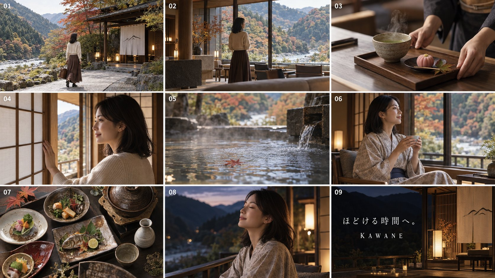

# Hotel PR Nine-Grid Storyboard → Gemini Omni

**中文标题：** 旅馆 PR：Image 2.5 九宫分镜→Gemini Omni  
**ID:** `gi25-x-509` · **Mode:** `generate`  
**Categories:** `general`, `ui-mockup`  
**Tags:** `x-twitter`, `community`, `gpt-image-2.5`, `xianyu`, `ja`



### Hotel PR Nine-Grid Storyboard → Gemini Omni

```text
温泉旅館「KAWANE」のブランドムービー用フォトストーリーボードを、1枚の画像として生成してください。

【広告コンセプト】
「ほどける時間へ。」

都会で忙しく働く女性が山間の温泉旅館を訪れ、景色、お茶、温泉、食事を通じて、少しずつ心を解放していく物語。観光地の華やかさではなく、静かな時間と丁寧なおもてなしを価値として描く。

【画面構成】
全体は16:9の横長。
3列×3行、全9コマの均等なフォトグリッド。
各コマも横長16:9。
コマの間には細いアイボリー色の余白を入れる。
左上から右方向へ「01」〜「09」の小さな白い番号を、各コマ左上に配置する。
説明文やカット名は表示しない。

すべてのコマを、実際に撮影された高級旅館のTVCMから切り出したようなフォトリアルな映像品質にする。

【主人公】
30代前半の日本人女性。
肩に触れる長さの自然な黒髪。
上品で親しみやすい顔立ち、自然な瞳、控えめなメイク。
肌の毛穴や柔らかな陰影を残し、過度な美肌加工は行わない。
到着時は生成りのニット、ダークブラウンのロングスカート、革靴、小さな旅行バッグ。
館内では同じ女性が落ち着いたベージュ系の浴衣を着用する。
顔、髪型、体格を全カットで統一する。

【ロケーション】
山と清流に囲まれた現代的な温泉旅館。
木、石、和紙、土壁を取り入れた静かな和モダン建築。
窓の外には色づき始めた山、川、紅葉。
観光施設らしい派手さを避け、品のある落ち着いた空間にする。

【9コマの内容】

01：
午後の山間に佇む旅館の外観。
女性が小さな旅行バッグを持ち、石畳を歩いて玄関へ向かっている。
旅館、川、山、紅葉がひとつの画面に収まる広い導入カット。

02：
吹き抜けのロビー。
女性が大きな窓の前で立ち止まり、山と川を眺めている。
後ろ斜めから撮影したミディアムワイド。
木造建築と窓から入る自然光を美しく見せる。

03：
スタッフの手がお茶と小さな和菓子を木製テーブルへ置く瞬間の接写。
陶器の質感、薄い湯気、菓子の繊細な造形、丁寧な所作を描く。

04：
女性が客室の障子を開ける場面。
手元と横顔を近距離から捉え、障子の向こうに山の景色と柔らかな光が広がる。

05：
露天風呂の湯面を捉えたマクロショット。
水面に赤い落ち葉が一枚浮かび、細かな波紋と湯気が広がる。
人物は映さない。

06：
浴衣姿の女性が窓辺の椅子に座り、両手で湯呑みを持ってお茶を飲む。
横顔に午後の柔らかな光が当たり、緊張が解けた穏やかな表情。

07：
夕食の会席料理を真上から撮影したフラットレイ。
川魚、季節の野菜、土鍋、小鉢、酒器を端正に配置する。
器、木目、料理の色彩を高精細に描く。

08：
夕暮れの縁側に座る女性の親密なポートレート。
目を静かに閉じ、秋の空気を吸い込むような自然な表情。
山のシルエットと行灯の光が背景で柔らかくぼける。

09：
夜の客室と縁側を捉えた締めのブランドカット。
右側に暖簾、木の格子、光る行灯。
左側には暗い山と文字用の余白を確保する。
左側に正確な日本語で「ほどける時間へ。」
その下に、字間を広く取った上品なセリフ体で「KAWANE」。

【撮影表現】
日本の高級旅館広告。
標準〜中望遠レンズを中心に、料理やお茶はマクロレンズ。
午後から夕暮れ、夜へ自然に時間が進行する。
木の温かさ、石の冷たさ、湯気、紙、陶器の質感を丁寧に描く。
滑らかなハイライト、奥行きのある影、微細なフィルムグレイン。

【禁止事項】
アニメ、イラスト、CG感の強い表現、過度なオレンジ加工、強い霞、非現実的な豪華さ、人物の顔の変化、手指の破綻、余分な人物、指定外のコピー、透かし、余分なロゴを入れない。
```

- **Recommended model:** `gpt-image-2.5-sunburst`
- **Settings:** _(defaults)_
- **Source:** [community](https://x.com/husky__create/status/2100162861045817624) — @husky__create (via xianyu110/awesome-gpt-image2.5)
- **License note:** Community X post mirrored in xianyu110/awesome-gpt-image2.5; remix with attribution
- **Notes:** xianyu110 case 2100162861045817624; category=场景视觉
- **Preview:** `previews/gi25-x-509.jpg`
