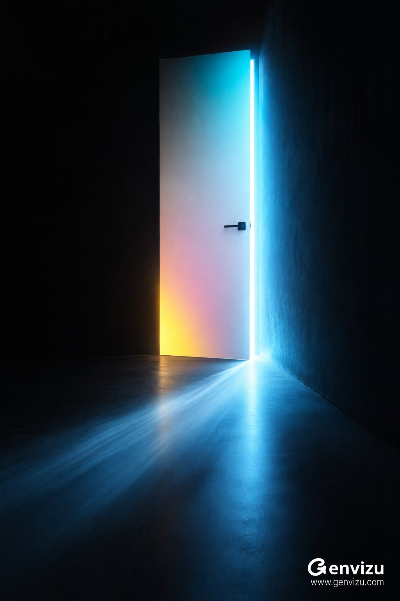

# Acidic Door-Gap Still Life: Teal Long-Exposure Black Void

**中文标题：** Acidic 门缝静物：青光长曝光黑空间  
**ID:** `gi25-x-524` · **Mode:** `generate`  
**Categories:** `general`  
**Tags:** `x-twitter`, `community`, `gpt-image-2.5`, `xianyu`, `en`



### Acidic Door-Gap Still Life: Teal Long-Exposure Black Void

```text
stylized-concept. Asset type: vertical experimental interior photograph. Create a new 2:3 portrait image inside an almost completely black architectural void. A single narrow, tall matte-white door stands upright near the center, slightly to the right, viewed straight on; the top edge nearly disappears into darkness. The door is ajar by a small angle, releasing an intense cold cyan-blue light that floods the right wall and sweeps across the dark floor as a broad diagonal wedge. Across the door surface, soft acidic color contamination transitions from cyan at the top through cool white to pale magenta and a concentrated amber-yellow glow near the lower left. Add one minimal black horizontal lever handle on the right side of the door. Use a long-exposure photographic effect in the projected floor light and peripheral glow: smooth blue light drag, soft blooming and subtle color bleed, while the door geometry and handle remain crisp. Deep velvety blacks, high contrast, restrained film grain, clean architectural minimalism, no people, no furniture, no text, no logo, no watermark, no border, no extra objects.
```

- **Recommended model:** `gpt-image-2.5-sunburst`
- **Settings:** _(defaults)_
- **Source:** [community](https://x.com/listudio/status/2100075950360945150) — @listudio (via xianyu110/awesome-gpt-image2.5)
- **License note:** Community X post mirrored in xianyu110/awesome-gpt-image2.5; remix with attribution
- **Notes:** xianyu110 case 2100075950360945150; category=场景视觉; verified=True
- **Preview:** `previews/gi25-x-524.jpg`
