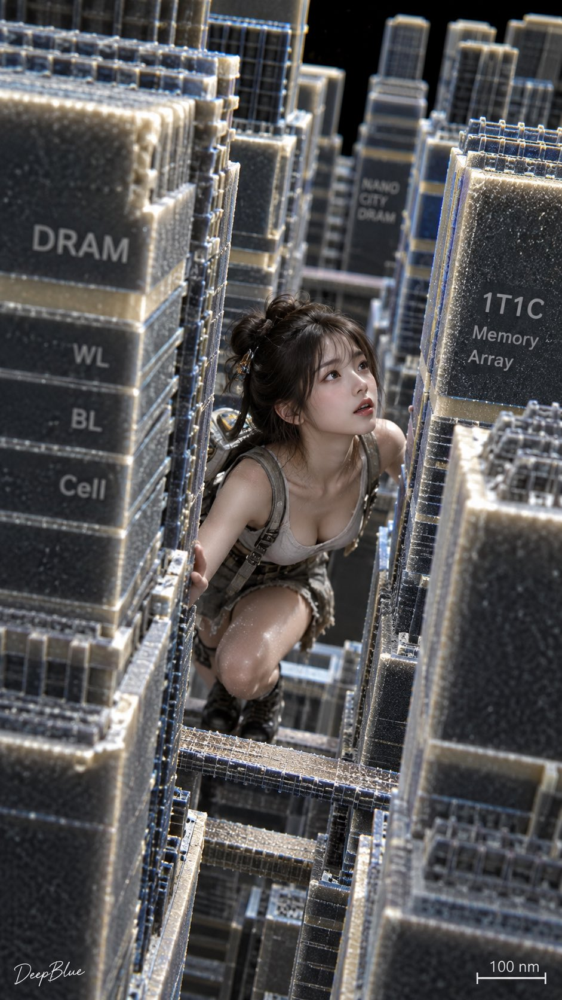

# DRAM Nano City: Electron-Microscope View, Structured Chinese Prompt

**中文标题：** DRAM 纳米城：电子显微镜视角结构化中文  
**ID:** `gi25-x-526` · **Mode:** `generate`  
**Categories:** `general`  
**Tags:** `x-twitter`, `community`, `gpt-image-2.5`, `xianyu`, `zh`



### DRAM Nano City: Electron-Microscope View, Structured Chinese Prompt

```text
图1
真实东方女性 × 纳米级真人 × 穿梭在巨大存储单元之间 × DRAM存储城市 × 纳米摩天大楼 × 密集晶体管阵列 × 电子显微镜视角抓拍 × 微观黑色背景

图2
真实东方女性 × 纳米级真人 × 穿梭在巨大存储结构之间 × 可爱俏皮表情 × 双手扶着巨大存储结构探头张望 × 3D NAND存储城市 × 纳米摩天大楼 × 无限堆叠存储单元 × 电子显微镜视角抓拍 × 微观黑色背景
```

- **Recommended model:** `gpt-image-2.5-sunburst`
- **Settings:** _(defaults)_
- **Source:** [community](https://x.com/DeepBlueX0/status/2100051568154538130) — @DeepBlueX0 (via xianyu110/awesome-gpt-image2.5)
- **License note:** Community X post mirrored in xianyu110/awesome-gpt-image2.5; remix with attribution
- **Notes:** xianyu110 case 2100051568154538130; category=场景视觉; verified=True
- **Preview:** `previews/gi25-x-526.jpg`
