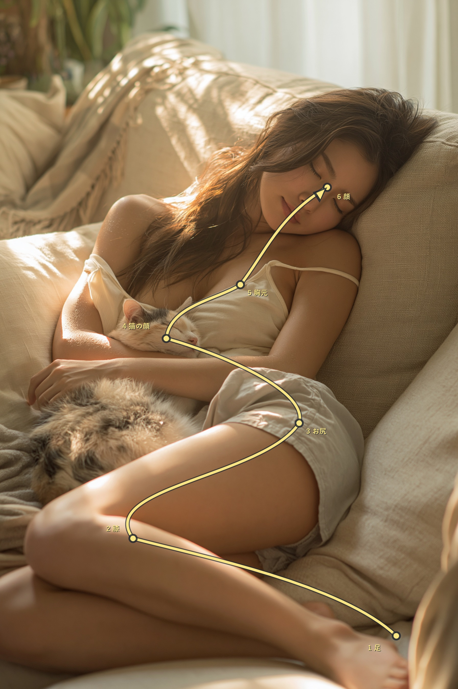

# Still Image to Aerial Camera-Path Guide for Seedance

**中文标题：** 静止画→航拍路径可视化→Seedance 成片  
**ID:** `gi25-x-528` · **Mode:** `edit`  
**Categories:** `general`, `edit-change-preserve`  
**Tags:** `x-twitter`, `community`, `gpt-image-2.5`, `xianyu`, `ja`



### Still Image to Aerial Camera-Path Guide for Seedance

```text
添付画像をSeedance用のカメラ経路ガイドにしてください。
元画像は一切描き直さず、次の順番を通る一本の細い黄色い線と、進行方向を示す矢印だけを重ねてください。
経路：［始点］→［経由点1］→［経由点2］→［経由点3］→［経由点4］→［終点］
各点は画像内の実際の位置に合わせ、被写体の輪郭に沿って左右へ緩やかに折り返しながら、滑らかな曲線でつないでください。点の順番が分かる小さな番号を付けます。線や番号は顔などの重要な部分をできるだけ隠さないよう配置してください。人物・動物・背景・構図・色味は変更しないでください。
```

- **Recommended model:** `gpt-image-2.5-sunburst`
- **Settings:** _(defaults)_
- **Source:** [community](https://x.com/agi_aibusi/status/2100004003237204394) — @agi_aibusi (via xianyu110/awesome-gpt-image2.5)
- **License note:** Community X post mirrored in xianyu110/awesome-gpt-image2.5; remix with attribution
- **Notes:** xianyu110 case 2100004003237204394; category=场景视觉; verified=True
- **Preview:** `previews/gi25-x-528.jpg`
