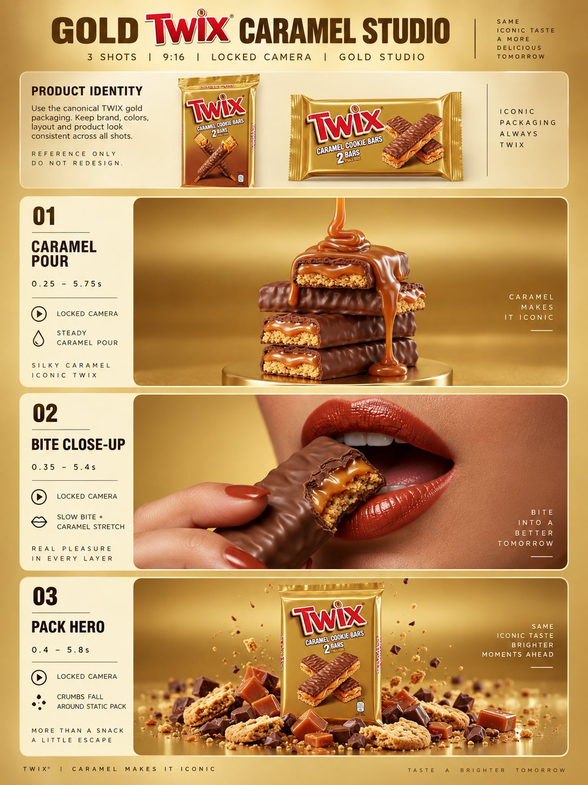

# TWIX Caramel Storyboard Commercial: Storyboard-Locked Three Shots

**中文标题：** TWIX 焦糖分镜商业片：故事板锁镜三镜头  
**ID:** `gi25-x-532` · **Mode:** `edit`  
**Categories:** `general`, `edit-change-preserve`  
**Tags:** `x-twitter`, `community`, `gpt-image-2.5`, `xianyu`, `en`



### TWIX Caramel Storyboard Commercial: Storyboard-Locked Three Shots

```text
Use the uploaded storyboard image as the primary visual reference.

Create a premium 9:16 vertical TWIX Caramel Cookie Bars commercial, about 15.5–16 seconds long, in 3 shots, following the storyboard exactly.

Keep the same saturated warm gold seamless studio, glossy commercial lighting, caramel-brown and gold palette, and premium food-advertising style throughout.

Maintain product consistency across all shots:
- TWIX bars = biscuit cookie base + chewy caramel layer + milk chocolate coating
- TWIX pack = gold flow-wrap, readable white TWIX letters with red sides, sealed, upright, centered where shown

Use clean straight cuts only.
No text overlays.
No slogans.
No camera shake.
No morphing.
All shots use a locked camera.

SHOT 1:
Stacked unwrapped TWIX bars on a glossy gold cylindrical pedestal in the gold studio. One bar shows its interior cross-section. A thick glossy caramel stream pours from above onto the top bar, coats it, and drips down the sides onto the pedestal. The stack stays still. Locked camera. End with a few heavy caramel drips.

SHOT 2:
Extreme close-up of an adult woman’s mouth with caramel-red lipstick against the gold background. She holds a bitten TWIX bar to her lips. She takes one slow small bite. The cookie compresses slightly and a thin caramel string stretches briefly, then settles. Her head stays nearly still. Locked camera. End with the bitten bar still at her lips.

SHOT 3:
Hero packshot in the same gold studio. The upright TWIX pack stands centered, surrounded by a low ring of broken cookie pieces, caramel shards, and chocolate chunks. Small crumbs and chocolate bits fall slowly from above around the pack and settle onto the pile. The pack stays still and readable. Locked camera.

Food realism is critical:
glossy caramel, realistic biscuit texture, realistic chocolate coating, appetizing bite mark, clean premium studio finish.

Do not generate:
children, extra people, extra products, KitKat, Nestlé, wrapper in shot 1 or 2, messy chocolate, smoke, steam, dark backgrounds, floating pack, rotating pack, chaotic particles, text overlays, subtitles, or surreal motion.

Final feel: iconic, appetizing, glossy, controlled, premium gold-studio food commercial.
```

- **Recommended model:** `gpt-image-2.5-sunburst`
- **Settings:** _(defaults)_
- **Source:** [community](https://x.com/NoravaleAI/status/2099850452426961352) — @NoravaleAI (via xianyu110/awesome-gpt-image2.5)
- **License note:** Community X post mirrored in xianyu110/awesome-gpt-image2.5; remix with attribution
- **Notes:** xianyu110 case 2099850452426961352; category=场景视觉; verified=True
- **Preview:** `previews/gi25-x-532.jpg`
