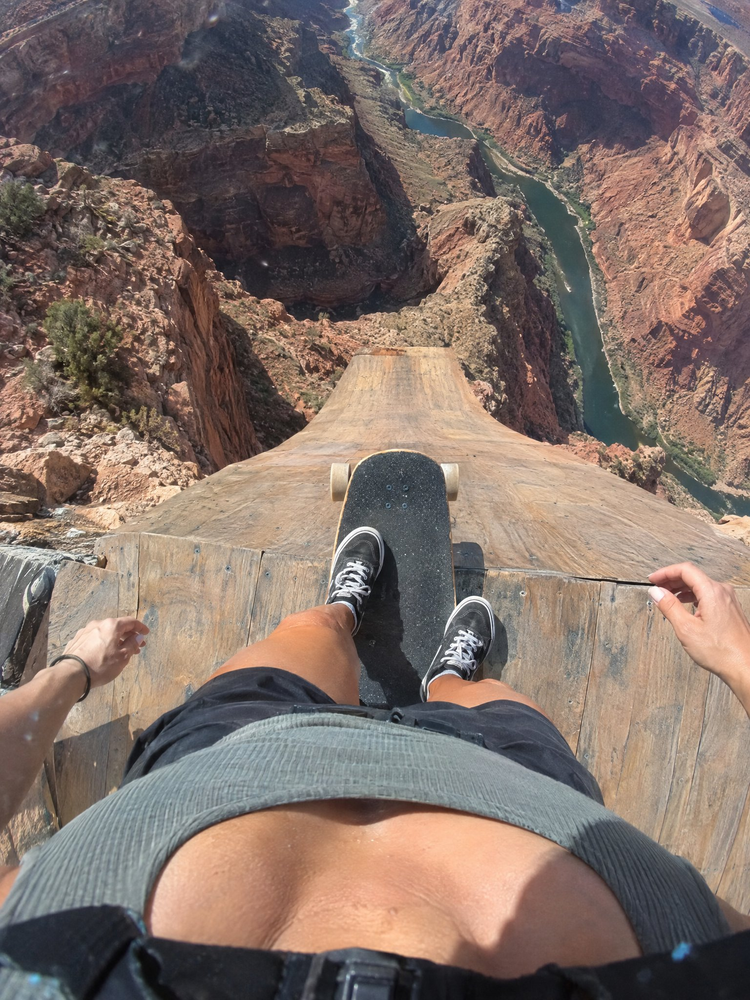

# Flare for a Real GoPro Chest-Mount Frame, Then Into Seedance

**中文标题：** Flare 出「真 GoPro 机位」再喂 Seedance  
**ID:** `gi25-x-542` · **Mode:** `generate`  
**Categories:** `general`  
**Tags:** `x-twitter`, `community`, `gpt-image-2.5`, `xianyu`, `en`



### Flare for a Real GoPro Chest-Mount Frame, Then Into Seedance

```text
DIRECTIVE:
Produce one still that reads as a real GoPro chest-mount first-person frame an instant before a downhill skate drop. Optical capture, available daylight, lived-in action-cam grit, extreme vertigo. Text-to-image only.

SUBJECT / POV:
Strict first-person from a chest-mounted GoPro on a woman skateboarder. Looking DOWN her own body: upper frame shows her athletic neckline and collarbones (fitted crop top / sports tank), mid frame her arms and the skateboard deck underfoot, lower frame her feet planted on the grip tape, trucks and wheels visible at the lip. Hands may enter for balance. No face — downward body POV only. One coherent body.

BEAT:
Stopped at the brink of ONE insanely steep wooden launch ramp on a canyon rim, about to roll. Board tip hangs over empty air.

SCENE / RAMP (ONE ONLY):
A single continuous steep wooden downhill skate ramp under the board — planks visibly slope down toward empty air. No second ramp. Beyond the lip: Grand Canyon / Colorado River canyon, sheer red-rock cliffs, the river a thin ribbon far below. Real outdoor location, wind, dust.

COMPOSITION:
3:4 vertical GoPro. Extreme downward tilt: body and board dominate the near field; the canyon yawns beyond the ramp lip. Feet huge, river tiny — pure vertigo. Tall frame stacks top → deck → plunging ramp → abyss.

CAMERA PACK:
GoPro chest mount, wide fisheye-ish action FOV, high shutter daylight, slight rolling shutter, scuffs on the lens, single JPEG from a real session.

LIGHT:
Harsh high-desert sun, hard shadows on the deck and collarbones, bright canyon bounce from red rock.

PHOTOGRAPHIC CHARACTER:
Consumer action-cam realism, flat-ish GoPro color, grit and dust motes, cliff-edge vertigo.
```

- **Recommended model:** `gpt-image-2.5-flare`
- **Settings:** _(defaults)_
- **Source:** [community](https://x.com/techhalla/status/2099627433754300803) — @techhalla (via xianyu110/awesome-gpt-image2.5)
- **License note:** Community X post mirrored in xianyu110/awesome-gpt-image2.5; remix with attribution
- **Notes:** xianyu110 case 2099627433754300803; category=场景视觉; verified=True
- **Preview:** `previews/gi25-x-542.jpg`
