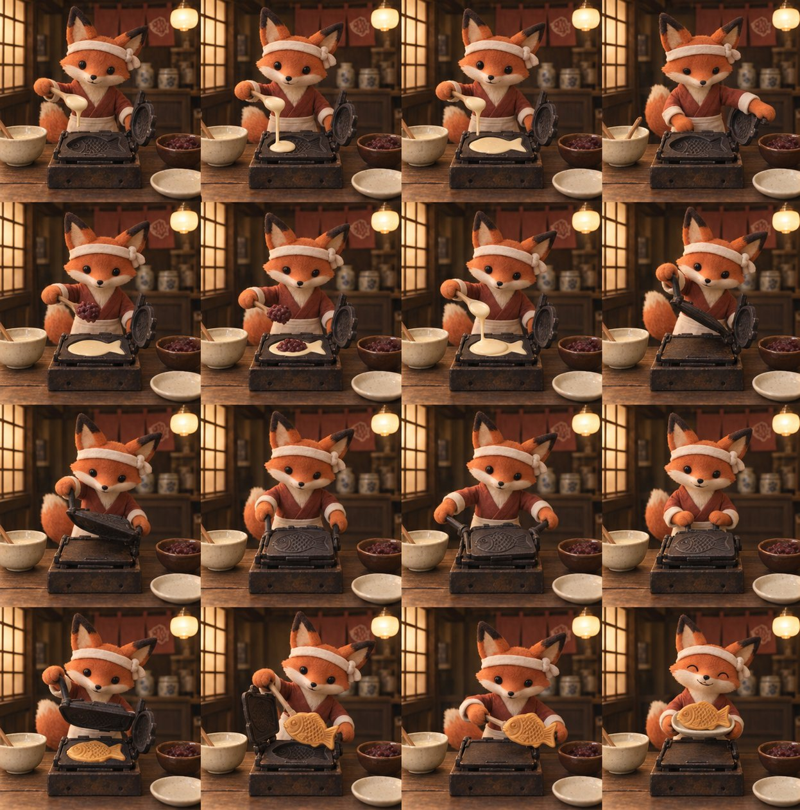

# Clay Fox Baking Taiyaki: 16-Frame Stop-Motion Sequence

**中文标题：** 黏土狐狸烤鲷鱼烧：16 格停格序列  
**ID:** `gi25-x-548` · **Mode:** `generate`  
**Categories:** `general`  
**Tags:** `x-twitter`, `community`, `gpt-image-2.5`, `xianyu`, `en`



### Clay Fox Baking Taiyaki: 16-Frame Stop-Motion Sequence

```text
Create a beautiful handmade clay stop-motion animation contact sheet, exactly 4 columns by 4 rows, sixteen equally sized square frames in chronological row-major order. No borders, gutters, frame numbers or overlaid text. Original little fox baking Japanese taiyaki in a nostalgic Japanese neighborhood taiyaki shop at night.

Character: charming original orange-red little fox clay puppet, cream pointed muzzle and chest, large triangular ears with dark tips, black bead eyes, distinct elegant fox face and one fluffy sculpted tail visible beside torso, happy gentle expression. White cloth headband, muted rust-red cross-collar work jacket with cream cuffs and cream waist apron. Matte plasticine with subtle fingerprints, rounded hand sculpted forepaws, miniature practical photography.
Set: beautifully aged dark cedar shop interior, warm buttery light from vintage milk-glass pendant at upper right, softly glowing frosted wood lattice window at left, faded rust-red short noren at upper back center, old ceramic jars on a small back ledge, subtle patina and handcraft. Dark warm walnut counter. Golden subject against softly blurred brown background. 

Cozy Showa-inspired sweets shop, amber highlights, not uniformly orange. No sushi, no rice barrel, no modern bright tiles. No other characters.

Props: one hinged cast iron single-fish taiyaki mold centered on a small vintage cooking stand on counter, lower fish-shaped cavity clearly visible to camera, hinged upper lid swings back upright when open. Small cream bowl of pale batter at screen left with spoon, small brown bowl of burgundy red bean paste at screen right, small cream serving plate near front right. The finished taiyaki is a golden fish-shaped waffle with recognizable tail, round eye and embossed scale pattern, not a real fish.

Critical: identical locked slightly elevated frontal medium shot in all 16 cells, exactly same fox identity and torso placement, background, counter and prop positions. Only forepaws, mold lid, batter and facial expression change. Keep camera perfectly static for stop motion. Full ears and hands in frame, mold large and readable.

Frame sequence:
1 fox holding spoon of pale batter above open empty fish mold.
2 batter starts pouring from spoon.
3 lower fish cavity filled with batter.
4 spoon set down, other paw reaches bean bowl.
5 spoon of burgundy bean paste above fish cavity.
6 deposits red bean paste into center of batter.
7 adds a little pale batter over bean filling.
8 paw reaches open upper lid handle.
9 upper lid lowered halfway.
10 upper lid fully closed.
11 both paws turn closed mold slightly by its handles.
12 closed mold settled back on cooking stand, fox anticipates.
13 opens upper lid halfway, golden taiyaki revealed.
14 upper lid fully open, fox lifts golden fish waffle with small wooden pick.
15 fox holds finished golden taiyaki over cream plate, proud smile.
16 fox displays taiyaki resting on plate held in both paws at chest height, closed-eye delighted smile.

Coherent readable food preparation, tiny frame-to-frame changes, handcrafted clay food and set, premium charming stop-motion look. Exactly 16 equal frames in strict 4x4 grid.
```

- **Recommended model:** `gpt-image-2.5-sunburst`
- **Settings:** _(defaults)_
- **Source:** [community](https://x.com/renoiseai/status/2099459517373391327) — @renoiseai (via xianyu110/awesome-gpt-image2.5)
- **License note:** Community X post mirrored in xianyu110/awesome-gpt-image2.5; remix with attribution
- **Notes:** xianyu110 case 2099459517373391327; category=像素动效; verified=True
- **Preview:** `previews/gi25-x-548.jpg`
