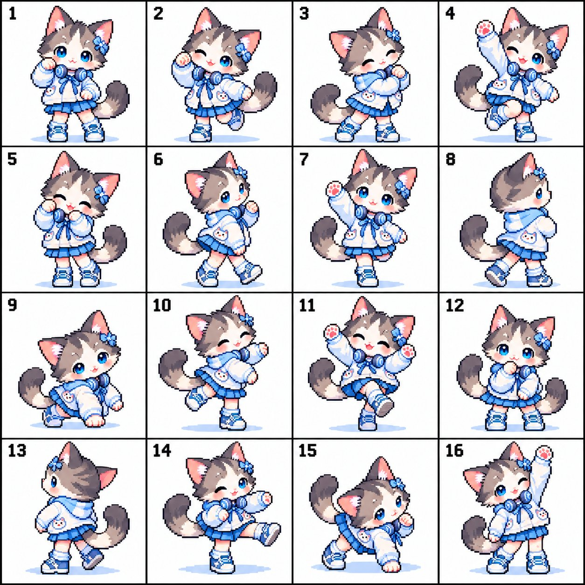

# Character to 4x4 Idol Dance Pose Sheet to GIF

**中文标题：** 角色→4×4 偶像舞姿表→GIF  
**ID:** `gi25-x-549` · **Mode:** `edit`  
**Categories:** `general`  
**Tags:** `x-twitter`, `community`, `gpt-image-2.5`, `xianyu`, `en`



### Character to 4x4 Idol Dance Pose Sheet to GIF

```text
Use the provided character image as the exact reference. Create a clean 4×4 pose sheet with exactly 16 full-body dance poses of the same character, arranged left to right, top to bottom. Keep the character fully consistent in every panel: same design, outfit, colors, and shading. Preserve the same pixel-art style, chibi proportions, sprite scale, outline, colors, and shading.
Make 16 clearly different but smoothly connectable cute idol dance poses, including: neutral pose, wink, side sway, raised arm, hands-near-cheeks, walking step, slight lean, side turn, crouch, side kick, both paws raised, shy pose, back/three-quarter turn, forward kick, low diagonal lean, and final raised-paw wink pose. The whole sequence should feel like one continuous dance.
Each panel must contain only one complete full-body character with enough margin around ears, feet, and tail. Use a plain white background with thin black grid dividers and small black numbers 1–16 in the top-left of each panel. No extra characters, extra limbs, missing parts, costume changes, hairstyle changes, props, watermark, or text other than the panel numbers.
```

- **Recommended model:** `gpt-image-2.5-sunburst`
- **Settings:** _(defaults)_
- **Source:** [community](https://x.com/ImaStudio_ai/status/2099445897457446934) — @ImaStudio_ai (via xianyu110/awesome-gpt-image2.5)
- **License note:** Community X post mirrored in xianyu110/awesome-gpt-image2.5; remix with attribution
- **Notes:** xianyu110 case 2099445897457446934; category=像素动效; verified=True
- **Preview:** `previews/gi25-x-549.jpg`
