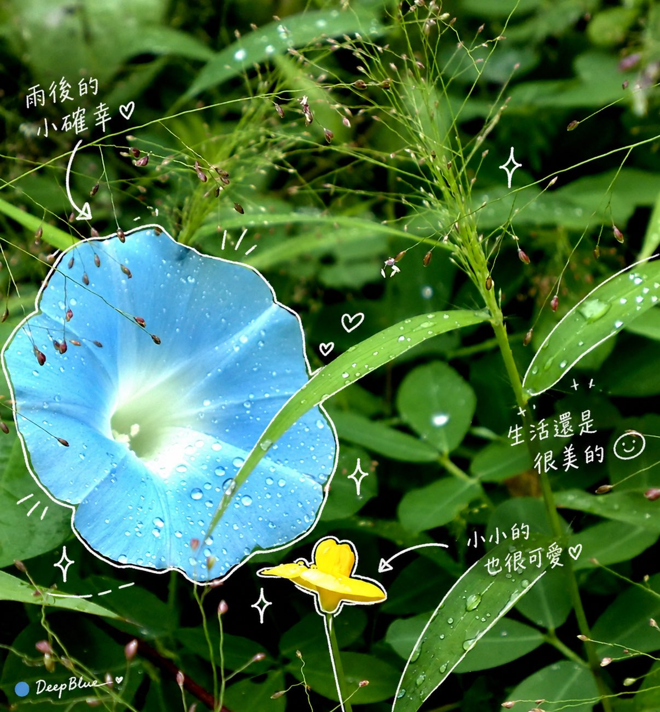

# Hand-Drawn Overlay on an Old Nokia Photo: White-Line Diary Edit

**中文标题：** Nokia 旧照手绘叠层：白线日记风改图  
**ID:** `gi25-x-550` · **Mode:** `edit`  
**Categories:** `general`, `edit-change-preserve`  
**Tags:** `x-twitter`, `community`, `gpt-image-2.5`, `xianyu`, `zh`



### Hand-Drawn Overlay on an Old Nokia Photo: White-Line Diary Edit

```text
在圖片上方加上一層手繪疊加。最終成品要時髦、放鬆、毫不費力地隨性。繪製規則：用細細的手繪線條，像是用白色筆畫上去。保持單筆勾勒風格：粗糙、略帶不均。沿著物件外緣加上描邊。可用箭頭或虛線引導視線。文字規則：使用手寫繁体中文。保持簡短，像輕鬆的內心獨白。語氣：像日記、簡短、以情緒為主。旁白要正面又甜甜的。裝飾：適度加入蒸氣、閃光、愛心、小小表情臉。不要太滿；留一些「留白」。
```

- **Recommended model:** `gpt-image-2.5-sunburst`
- **Settings:** _(defaults)_
- **Source:** [community](https://x.com/DeepBlueX0/status/2099429070723551484) — @DeepBlueX0 (via xianyu110/awesome-gpt-image2.5)
- **License note:** Community X post mirrored in xianyu110/awesome-gpt-image2.5; remix with attribution
- **Notes:** xianyu110 case 2099429070723551484; category=场景视觉; verified=True
- **Preview:** `previews/gi25-x-550.jpg`
