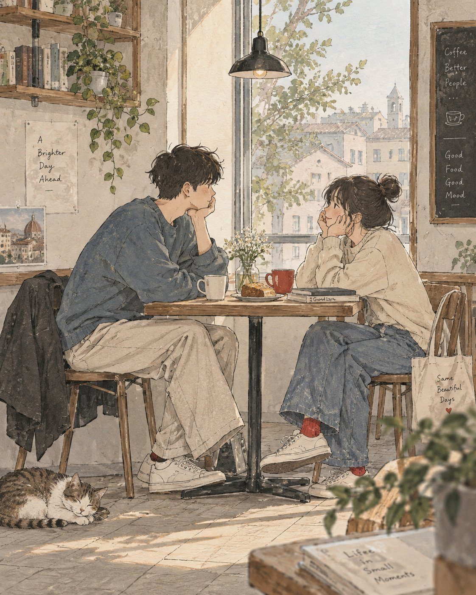

# Japanese Slice-of-Life Style Lock: Pen and Wash with Red Accent

**中文标题：** 日系日常 STYLE 锁：钢笔淡彩+小红点  
**ID:** `gi25-x-553` · **Mode:** `generate`  
**Categories:** `general`  
**Tags:** `x-twitter`, `community`, `gpt-image-2.5`, `xianyu`, `en`



### Japanese Slice-of-Life Style Lock: Pen and Wash with Red Accent

```text
Create a delicate contemporary Japanese slice-of-life illustration showing a quiet, cozy everyday moment.

STYLE

Hand-drawn pen-and-ink artwork with fine expressive lines, naturally imperfect contours, subtle watercolor washes, visible paper texture, soft edges, and generous negative space. Blend Japanese minimalism with the charm of an independent sketchbook, café magazine, or modern lifestyle art book. Keep the artwork elegant, airy, tactile, and slightly unfinished.

CHARACTERS

Two young adults with simplified facial features, subtle expressions, relaxed body language, and natural interaction. Dress them in casual oversized contemporary clothing. Avoid realistic facial rendering; communicate personality through posture, gestures, and eye direction.

ENVIRONMENT

A warm, lived-in interior such as a café, apartment, studio, bookstore, kitchen corner, or creative workspace. Include selective details like wooden furniture, coffee cups, books, shelves, plants, windows, ceramics, stationery, and small everyday objects. Keep the setting uncluttered.

COMPOSITION

Full-body or three-quarter view at eye level. Seat the characters naturally facing one another. Use a balanced asymmetrical composition with generous clean space and an editorial framing. The relationship between the characters should be the main storytelling element.

COLORS

Use only muted, desaturated tones: warm cream, ivory, dusty blue, soft beige, light gray, sage green, natural brown, and off-white. Add one small red accent such as a mug, shoe, sock, notebook, or object.

LIGHTING

Soft natural daylight through a window with gentle ambient illumination and minimal shadows. Create a peaceful, warm, nostalgic atmosphere without dramatic lighting.

RENDERING

Sparse detail, delicate watercolor fills within fine ink outlines, subtle tonal variation, visible paper grain, and authentic hand-drawn imperfections. Avoid overly polished digital rendering.

AVOID

Anime, manga panels, cel shading, photorealism, hyperrealism, 3D rendering, glossy surfaces, vibrant colors, cinematic effects, heavy outlines, harsh shadows, and cluttered backgrounds.

SCENE

[Scene Description]

The final image should feel like a premium contemporary Japanese lifestyle illustration-quiet, intimate, nostalgic, and beautifully ordinary, with the warmth of a carefully observed sketchbook moment.
```

- **Recommended model:** `gpt-image-2.5-sunburst`
- **Settings:** _(defaults)_
- **Source:** [community](https://x.com/Goodmanprotocol/status/2099417903858843997) — @Goodmanprotocol (via xianyu110/awesome-gpt-image2.5)
- **License note:** Community X post mirrored in xianyu110/awesome-gpt-image2.5; remix with attribution
- **Notes:** xianyu110 case 2099417903858843997; category=场景视觉; verified=True
- **Preview:** `previews/gi25-x-553.jpg`
