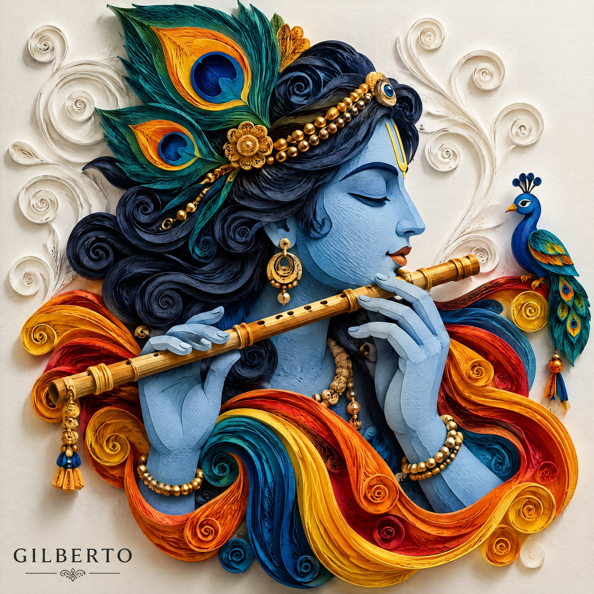

# Sunburst 4K Paper-Quilling Krishna: Gold Lines + Quilled Relief

**中文标题：** Sunburst 4K 纸雕奎师那：金线+卷纸浮雕  
**ID:** `gi25-x-556` · **Mode:** `generate`  
**Categories:** `general`  
**Tags:** `x-twitter`, `community`, `gpt-image-2.5`, `xianyu`, `en`



### Sunburst 4K Paper-Quilling Krishna: Gold Lines + Quilled Relief

```text
A detailed 3D paper quilling bas-relief artwork of Lord Krishna playing a golden flute, shown in side profile with closed eyes, soft blue skin, a yellow tilak on his forehead, and a peaceful expression.

His flowing dark hair is crafted from intricate coiled paper strips, adorned with large paper-quilled peacock feathers in vibrant teal, yellow, and orange, paired with a beaded gold headband. His hands softly hold the wooden flute while a small stylized blue paper peacock perches near the end.

Richly layered paper swirls in vibrant orange, yellow, red, and blue cascade around his shoulders. Clean off-white background with subtle embossed white paper swirl patterns and dramatic studio shadows. High-detail paper sculpture aesthetic, 3D papercraft depth.
```

- **Recommended model:** `gpt-image-2.5-sunburst`
- **Settings:** _(defaults)_
- **Source:** [community](https://x.com/yourPlugAI/status/2099386679551279392) — @yourPlugAI (via xianyu110/awesome-gpt-image2.5)
- **License note:** Community X post mirrored in xianyu110/awesome-gpt-image2.5; remix with attribution
- **Notes:** xianyu110 case 2099386679551279392; category=场景视觉; verified=True
- **Preview:** `previews/gi25-x-556.jpg`
