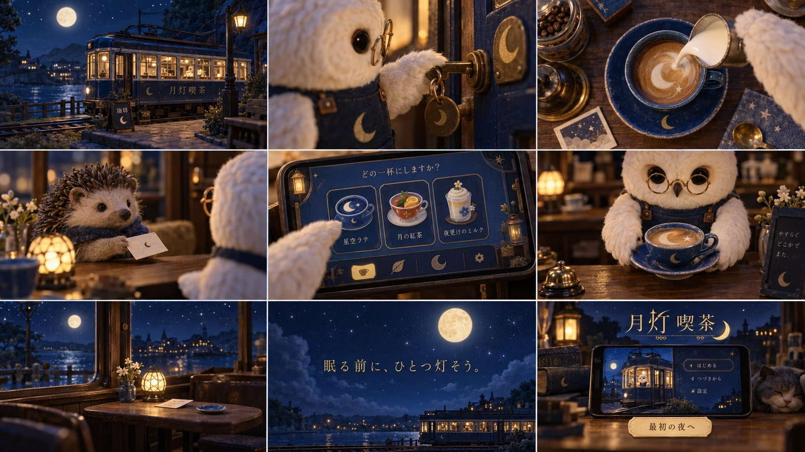

# Images 2.5 Nine-Grid to a 10-Second Gemini Game Commercial

**中文标题：** Images 2.5 九宫格 → Gemini 10 秒游戏 CM  
**ID:** `gi25-x-567` · **Mode:** `generate`  
**Categories:** `general`  
**Tags:** `x-twitter`, `community`, `gpt-image-2.5`, `xianyu`, `ja`



### Images 2.5 Nine-Grid to a 10-Second Gemini Game Commercial

```text
架空的喫茶店経営ゲーム「月灯喫茶」。
人間の出演なし。手作りストップモーションの質感。
夜の路面電車を改装した喫茶店。
白いフクロウ店主、丸メガネ、紺エプロン。
インディゴとバターイエロー。金の細い明朝体。

9コマ：
1. 月明かりの電車喫茶に一灯ともる
2. フクロウが鍵を開けるマクロ
3. 青い陶器にミルクを注ぐ俯瞰
4. 客のハリネズミが小さな手紙を置く
5. スマホのゲーム画面で飲み物を選ぶ
6. フクロウがカップを差し出す
7. 客が帰った窓際の席と星空
8. 「眠る前に、ひとつ灯そう。」
9. ゲーム画面、「月灯喫茶」「最初の夜へ」

陶器、木、布の手触りを精密に。静かな接客の楽しさを伝える。
```

- **Recommended model:** `gpt-image-2.5-sunburst`
- **Settings:** _(defaults)_
- **Source:** [community](https://x.com/uniyume/status/2098379926642831769) — @uniyume (via xianyu110/awesome-gpt-image2.5)
- **License note:** Community X post mirrored in xianyu110/awesome-gpt-image2.5; remix with attribution
- **Notes:** xianyu110 case 2098379926642831769; category=场景视觉; verified=True
- **Preview:** `previews/gi25-x-567.jpg`
