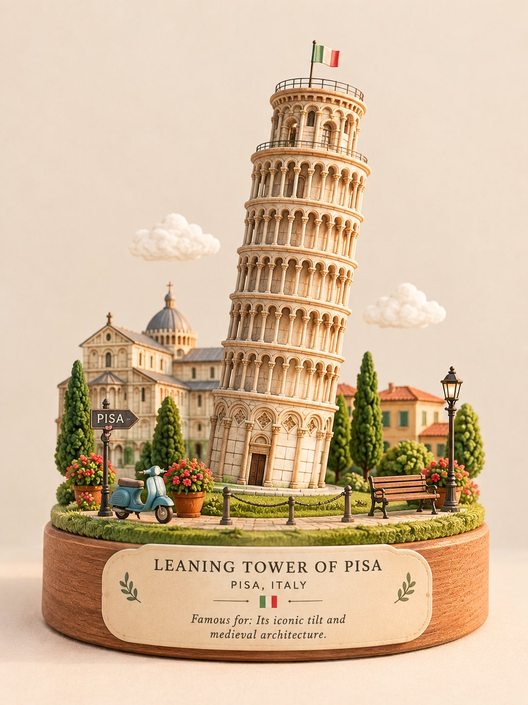

# Premium Miniature Diorama of a Landmark

**中文标题：** 地标精品微缩立体模型  
**ID:** `gi25-x-588` · **Mode:** `generate`  
**Categories:** `general`  
**Tags:** `x-twitter`, `community`, `gpt-image-2.5`, `atlascloud`, `en`



### Premium Miniature Diorama of a Landmark

```text
Create a premium cute miniature 3D diorama of [STRUCTURE NAME], [CITY, COUNTRY]. Keep the landmark recognizable, elegant, and charming, with clean composition, soft pastel tones, subtle handcrafted details, gentle natural lighting, and a refined travel-souvenir aesthetic.

Include minimal, tasteful text:
[STRUCTURE NAME]
[CITY, COUNTRY]
Famous for: [SHORT DESCRIPTION]
```

- **Recommended model:** `gpt-image-2.5-sunburst`
- **Settings:** _(defaults)_
- **Source:** [community](https://x.com/Naiknelofar788/status/2097580884098764800) — @Naiknelofar788 (via AtlasCloudAI/awesome-gpt-image-2.5-prompts)
- **License note:** CC BY 4.0 (AtlasCloudAI/awesome-gpt-image-2.5-prompts); original X post — remix with attribution
- **Notes:** AtlasCloudAI record 2; category=Style & Intelligence; prompt text taken from the original X post; verified=True
- **Preview:** `previews/gi25-x-588.jpg`
