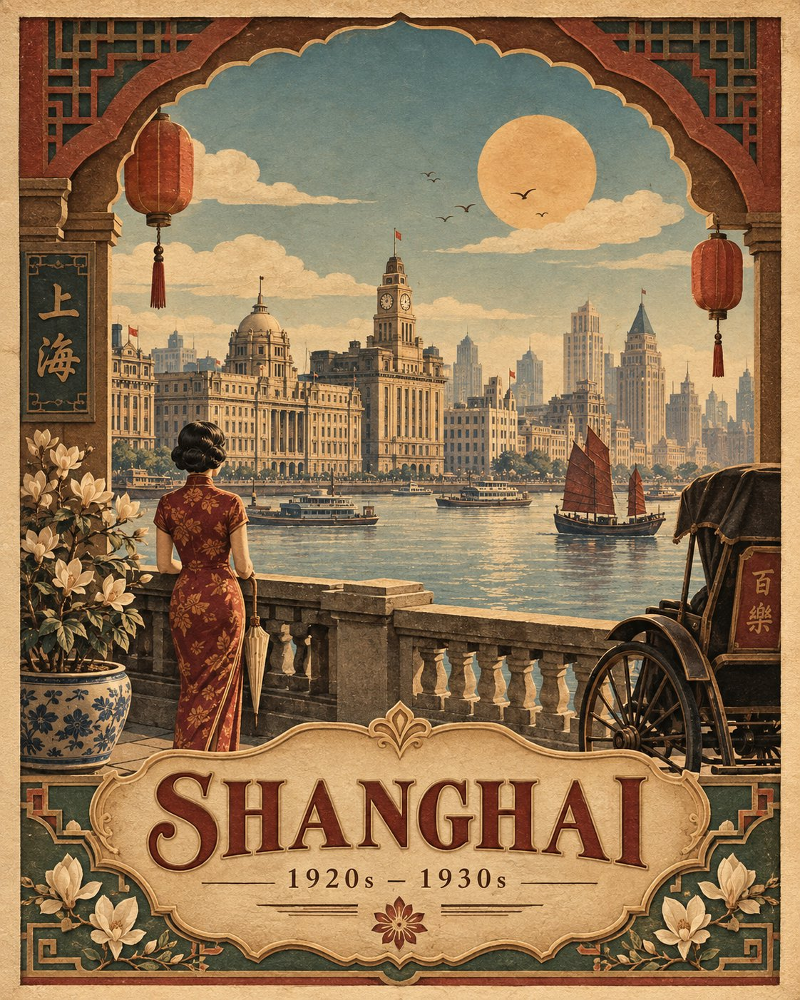

# Vintage Travel Poster for Location

**中文标题：** 地点主题复古旅行海报  
**ID:** `gi25-x-589` · **Mode:** `generate`  
**Categories:** `general`  
**Tags:** `x-twitter`, `community`, `gpt-image-2.5`, `atlascloud`, `en`



### Vintage Travel Poster for Location

```text
Create a premium vintage travel poster for [LOCATION], inspired by the 1920s–1930s, with a refined layered paper-relief and embossed illustration style. Use warm parchment, muted terracotta, olive, dusty blue and sepia tones, combined with subtle paper grain, soft dimensional shadows and elegant handcrafted detailing.

Design a vertical 4:5 composition with a clear visual hierarchy. An ornate scalloped architectural arch frames the scene, while a culturally iconic landmark becomes the main focal point in the middle distance. Surround it with a distinctive local landscape that creates natural depth and atmosphere.

Place a period-appropriate person viewed from behind in the foreground for scale, keeping them secondary to the landmark and occupying approximately 10–15% of the poster height. Add authentic 1920s–30s transportation, local vegetation and restrained decorative motifs to strengthen the sense of place without overcrowding the composition.

Create cinematic depth from foreground → figure and objects → architecture → landscape → sky, with a muted sun, stylized clouds and a few distant birds. Ensure the architecture, clothing, vegetation, vehicles and decorative elements are culturally authentic to [LOCATION] and historically appropriate to the era.

At the bottom, feature a large embossed “[LOCATION]” in elegant classical serif lettering on a substantial vintage cartouche, with “1920s – 1930s” beneath it and a small centered floral ornament.

Maintain generous negative space, balanced symmetry, sophisticated proportions, tactile paper layering and a cohesive luxury heritage travel-poster aesthetic. Avoid modern objects, contemporary typography, neon colors, photorealism, clutter and modern tourism graphics.
```

- **Recommended model:** `gpt-image-2.5-sunburst`
- **Settings:** _(defaults)_
- **Source:** [community](https://x.com/Goodmanprotocol/status/2097674044476887399) — @Goodmanprotocol (via AtlasCloudAI/awesome-gpt-image-2.5-prompts)
- **License note:** CC BY 4.0 (AtlasCloudAI/awesome-gpt-image-2.5-prompts); original X post — remix with attribution
- **Notes:** AtlasCloudAI record 22; category=Style & Intelligence; prompt text taken from the original X post; verified=True
- **Preview:** `previews/gi25-x-589.jpg`
