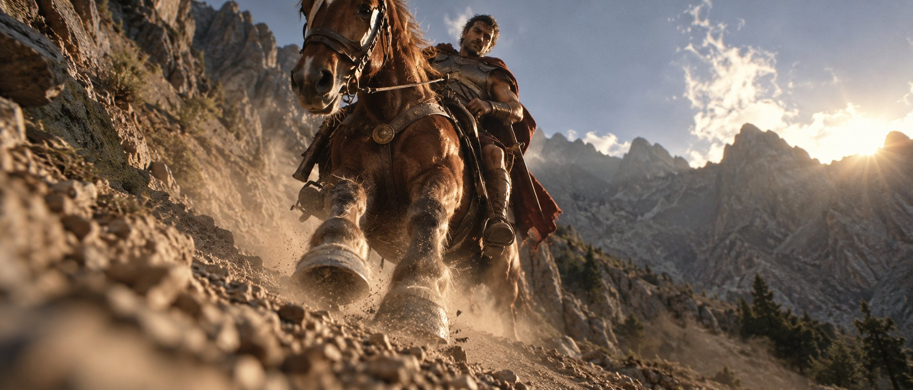

# Low-Angle Gladiator on Horseback

**中文标题：** 低机位马背角斗士  
**ID:** `gi25-x-593` · **Mode:** `generate`  
**Categories:** `general`  
**Tags:** `x-twitter`, `community`, `gpt-image-2.5`, `atlascloud`, `en`



### Low-Angle Gladiator on Horseback

```text
Extreme low-angle shot from the dusty rocky path on the mountainside, camera positioned close to the ground looking steeply upward as a gladiator in worn bronze armor and a faded red cloak rides a strong chestnut warhorse directly toward the lens along the steep incline. The horse’s powerful front legs and hooves fill the lower foreground, kicking up fine dust that catches the late afternoon light, while the gladiator leans forward in the saddle, one hand on the reins and the other resting on the hilt of his sword. Jagged mountain peaks and bright sky dominate the upper frame, creating strong vertical lines that emphasize the climb. Natural rim lighting outlines the edges of the armor and the horse’s mane, with visible film grain and slight motion blur on the moving legs. Atmospheric haze softens the distant ridges. no clean digital sharpness, no CGI look, no poster composition, no centered portrait, no black bars
```

- **Recommended model:** `gpt-image-2.5-sunburst`
- **Settings:** _(defaults)_
- **Source:** [community](https://x.com/hckinz/status/2097416227908153591) — @hckinz (via AtlasCloudAI/awesome-gpt-image-2.5-prompts)
- **License note:** CC BY 4.0 (AtlasCloudAI/awesome-gpt-image-2.5-prompts); original X post — remix with attribution
- **Notes:** AtlasCloudAI record 80; category=Style & Intelligence; prompt text taken from the original X post; verified=True
- **Preview:** `previews/gi25-x-593.jpg`
