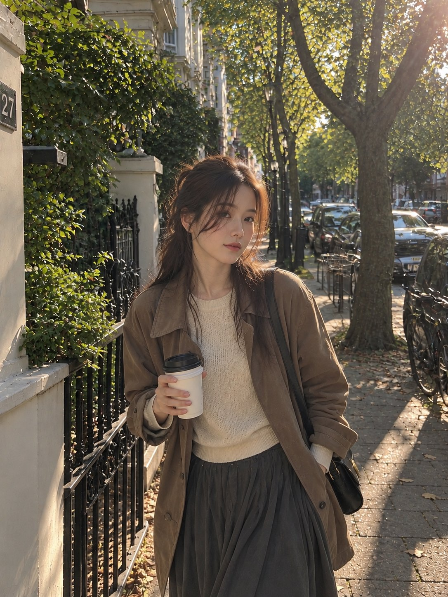

# Golden Hour Street Walk Photograph

**中文标题：** 黄金时刻街头漫步照  
**ID:** `gi25-x-596` · **Mode:** `generate`  
**Categories:** `general`  
**Tags:** `x-twitter`, `community`, `gpt-image-2.5`, `atlascloud`, `en`



### Golden Hour Street Walk Photograph

```text
A highly photorealistic candid smartphone photograph of a young woman walking slowly through a quiet tree-lined residential street during golden hour. She has medium-length dark chestnut hair styled in a slightly messy half-up hairstyle, with soft loose strands framing her cheeks and a few strands naturally lifted by the breeze. She looks slightly downward and away from the camera with a subtle, relaxed smile, as if caught in an unposed moment.

She wears a fitted cream knit sweater layered underneath a lightweight dusty-brown trench jacket, paired with a flowing ankle-length charcoal-gray skirt. A small vintage black leather crossbody bag rests naturally against her hip. She carries a takeaway coffee cup loosely in one hand while her other hand lightly adjusts the strap of her bag.

The woman is walking beside a narrow sidewalk lined with mature trees, small patches of grass, bicycles, parked cars, and understated apartment buildings in the distance. Warm late-afternoon sunlight shines through the branches from behind her, creating delicate rim lighting around her hair, realistic highlights on her clothing, soft elongated shadows across the pavement, and a subtle natural lens flare.

Natural handheld smartphone photography, authentic candid lifestyle aesthetic, realistic human proportions, natural facial asymmetry, visible skin texture and tiny imperfections, individual hair strands, realistic fabric folds and materials, slightly imperfect framing, soft atmospheric depth, warm but subdued exposure, muted neutral and earthy color palette, gentle vintage film grain, shallow natural depth of field, realistic background bokeh, cinematic but completely natural lighting, quiet everyday summer atmosphere, no studio look, no artificial beauty retouching, no plastic skin, no overly perfect features, extremely photorealistic, vertical 4:5 composition.
```

- **Recommended model:** `gpt-image-2.5-sunburst`
- **Settings:** _(defaults)_
- **Source:** [community](https://x.com/nicolecreats/status/2097286623327383930) — @nicolecreats (via AtlasCloudAI/awesome-gpt-image-2.5-prompts)
- **License note:** CC BY 4.0 (AtlasCloudAI/awesome-gpt-image-2.5-prompts); original X post — remix with attribution
- **Notes:** AtlasCloudAI record 193; category=Style & Intelligence; prompt text taken from the original X post; verified=True
- **Preview:** `previews/gi25-x-596.jpg`
