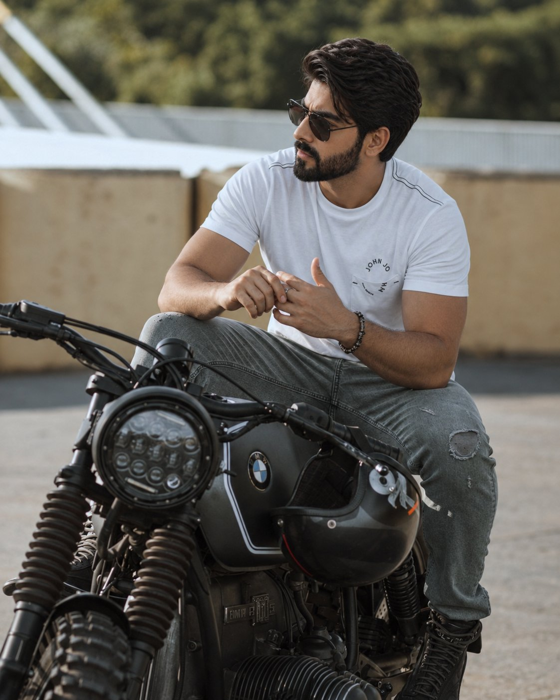

# Hyper-Realistic Cinematic Portrait on a Motorcycle

**中文标题：** 摩托车上的超写实电影感肖像  
**ID:** `gi25-x-602` · **Mode:** `generate`  
**Categories:** `general`  
**Tags:** `x-twitter`, `community`, `gpt-image-2.5`, `atlascloud`, `en`



### Hyper-Realistic Cinematic Portrait on a Motorcycle

```text
A hyper-realistic cinematic portrait of a stylish young bearded man wearing dark sunglasses, a fitted white T-shirt, ripped dark jeans, rugged boots, and subtle accessories, sitting confidently on a dark custom café-racer motorcycle. He leans slightly forward with his hands naturally positioned together, looking thoughtfully to the side. Outdoor urban setting with soft blurred greenery and concrete structures in the background, warm natural daylight, realistic shadows and reflections, shallow depth of field, DSLR photography, 85mm lens, f/1.8, ultra-detailed realistic skin texture, natural pores and facial hair, authentic clothing folds, cinematic color grading, sharp focus on the subject, realistic motorcycle details, premium lifestyle photography, photorealistic, no AI artifacts.
```

- **Recommended model:** `gpt-image-2.5-sunburst`
- **Settings:** _(defaults)_
- **Source:** [community](https://x.com/Xaroon_x/status/2098052790421713400) — @Xaroon_x (via AtlasCloudAI/awesome-gpt-image-2.5-prompts)
- **License note:** CC BY 4.0 (AtlasCloudAI/awesome-gpt-image-2.5-prompts); original X post — remix with attribution
- **Notes:** AtlasCloudAI record 1187; category=Style & Intelligence; prompt text taken from the original X post; verified=True
- **Preview:** `previews/gi25-x-602.jpg`
