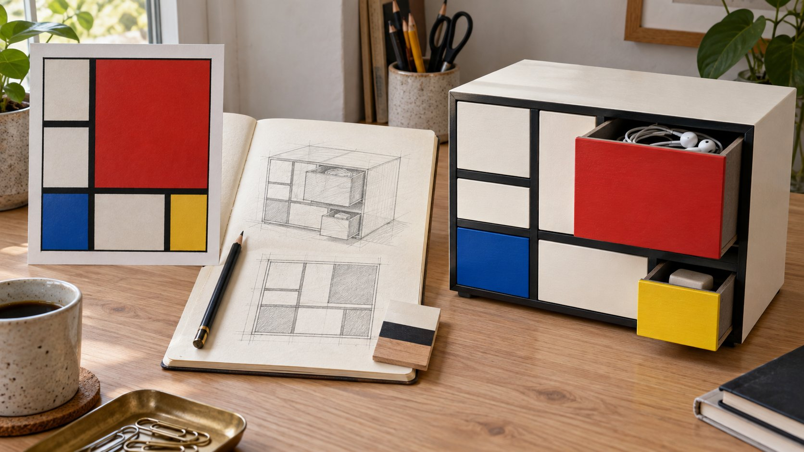

# Mondrian Composition as a Desktop Drawer Cabinet

**中文标题：** 蒙德里安杂物柜  
**ID:** `gi25-x-603` · **Mode:** `generate`  
**Categories:** `general`  
**Tags:** `x-twitter`, `community`, `gpt-image-2.5`, `xianyu`, `zh`



### Mondrian Composition as a Desktop Drawer Cabinet

```text
生成一张16:9横版桌面设计展示图。左侧放蒙德里安《红、蓝、黄的构成》的画作参考，中间是桌面收纳柜的正面网格与透视铅笔草图，右侧是使用效果。柜体采用象牙白涂装木材，粗黑色分隔条形成不对称矩形网格，红色大抽屉、蓝色小抽屉、黄色小抽屉与白色格子共同组成正面。红色抽屉拉开，里面放耳机与卷好的线；黄色抽屉略微拉开，露出橡皮。抽屉必须有真实侧壁、厚度和内部空间，并与各自格口对齐。表现涂装木材细纹、接触阴影和桌面使用痕迹，自然侧光。草图与柜体布局一致，不加文字、Logo或URL。
```

- **Recommended model:** `gpt-image-2.5-sunburst`
- **Settings:** _(defaults)_
- **Source:** [community](https://x.com/cellinlab/status/2097875217100296362) — @cellinlab (via xianyu110/awesome-gpt-image2.5)
- **License note:** Community X post mirrored in xianyu110/awesome-gpt-image2.5; remix with attribution
- **Notes:** xianyu110 case 2097875217100296362; category=UX产品; verified=True
- **Preview:** `previews/gi25-x-603.jpg`
