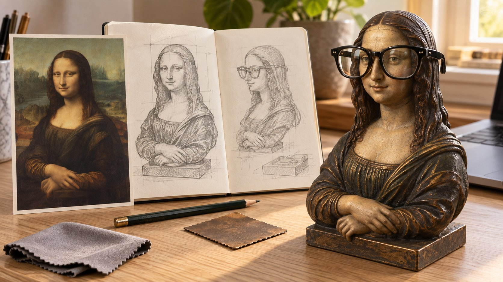

# Mona Lisa Bust Eyeglasses Stand

**中文标题：** 蒙娜丽莎眼镜架  
**ID:** `gi25-x-604` · **Mode:** `generate`  
**Categories:** `general`  
**Tags:** `x-twitter`, `community`, `gpt-image-2.5`, `xianyu`, `zh`



### Mona Lisa Bust Eyeglasses Stand

```text
生成一张16:9横版桌面设计展示图。左侧是《蒙娜丽莎》的画作参考，中间是同款胸像眼镜架的正面与侧面铅笔草图，右侧是放在浅橡木桌上的使用效果。胸像保留蒙娜丽莎的长发、神秘微笑、衣褶和交叠双手，采用做旧铜质与暗棕色表面，底座宽而稳定。一副真实的现代黑色厚框透明眼镜架在她的鼻梁上，镜腿自然延伸到耳侧，眼睛透过镜片可见。表现镜片反射、镜框小螺丝与铜像细微磨损。旁边放眼镜布和笔记本电脑一角，自然窗光。草图与物件一致，不加文字、Logo或URL。
```

- **Recommended model:** `gpt-image-2.5-sunburst`
- **Settings:** _(defaults)_
- **Source:** [community](https://x.com/cellinlab/status/2097871439072543175) — @cellinlab (via xianyu110/awesome-gpt-image2.5)
- **License note:** Community X post mirrored in xianyu110/awesome-gpt-image2.5; remix with attribution
- **Notes:** xianyu110 case 2097871439072543175; category=UX产品; verified=True
- **Preview:** `previews/gi25-x-604.jpg`
