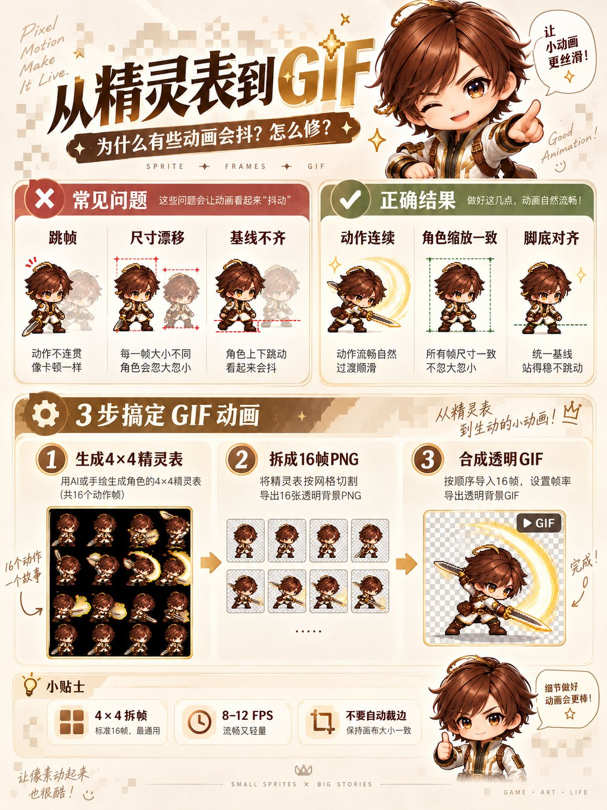

# 4×4 Pixel Battle Sprite Sheet to GIF

**中文标题：** 4×4像素战斗图→GIF  
**ID:** `gi25-x-605` · **Mode:** `edit`  
**Categories:** `general`, `edit-change-preserve`  
**Tags:** `x-twitter`, `community`, `gpt-image-2.5`, `xianyu`, `zh`



### 4×4 Pixel Battle Sprite Sheet to GIF

```text
上传图1作为角色身份与服装的唯一参考。

将图1角色转化为高质量2D像素游戏角色，生成一张正方形、4×4等分排列、共16帧的连续动作Sprite Sheet。

每格尺寸完全一致。画面按从左到右、从上到下的顺序播放。

严格保留角色的脸型、发型、体型、服装配色、标志性配件与武器结构。16帧使用相同的像素比例、角色尺寸、朝向和色板。

角色完成一次【挥剑攻击／跳跃／翻滚／施法／扑击】动作。

第1至3帧为待机与蓄力；第4至7帧为重心移动和动作展开；第8至10帧完成主要攻击与力量释放；第11至13帧表现惯性和收势；第14至16帧回到待机状态。第16帧与第1帧能够自然衔接。

相邻帧只改变完成动作所需的关节、轮廓、衣摆、头发和武器位置。动作方向、受力关系和运动轨迹保持连续。

所有格子保持相同机位、角色缩放、脚底基线和画面中心。角色完整显示，不裁切头部、武器、尾巴或特效。

背景优先使用透明通道。透明背景不稳定时，改用统一纯色背景，方便后期抠图。不要生成场景、地面纹理、格线、编号和文字。

采用清晰硬边像素、有限色板和统一像素密度。禁止模糊边缘、抗锯齿、半写实渲染、重复帧、跳帧、角色变形、服装变化、武器增减、视角切换和每格重新构图。
```

- **Recommended model:** `gpt-image-2.5-sunburst`
- **Settings:** _(defaults)_
- **Source:** [community](https://x.com/derek_wall90176/status/2097863751471157498) — @derek_wall90176 (via xianyu110/awesome-gpt-image2.5)
- **License note:** Community X post mirrored in xianyu110/awesome-gpt-image2.5; remix with attribution
- **Notes:** xianyu110 case 2097863751471157498; category=像素动效; verified=True
- **Preview:** `previews/gi25-x-605.jpg`
