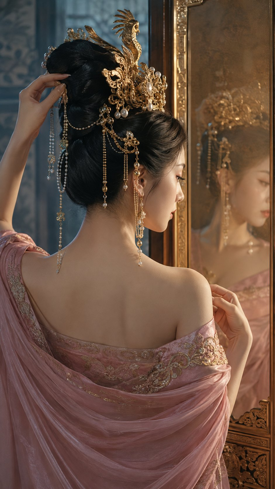

# Tang-Style CG Portrait from Behind with Bronze Mirror

**中文标题：** 美人背唐风CG  
**ID:** `gi25-x-607` · **Mode:** `generate`  
**Categories:** `general`  
**Tags:** `x-twitter`, `community`, `gpt-image-2.5`, `xianyu`, `zh`



### Tang-Style CG Portrait from Behind with Bronze Mirror

```text
9:16 竖版高级唐风 CG 人像海报，半身近景特写，电影级构图与空间透视。一位明确成年的东亚古典美人身体背向画面呈后三分之四方向，头部没有回看镜头，而是轻轻偏向右侧屏风；镜面铜屏中隐约映出她清冷的侧脸。她具有冷白真实肤质、微挑凤眼和自然胭脂唇，目光停留在镜中的凤冠流苏上，神态沉静、羞涩而克制。她穿雾粉色露肩披帛式唐风礼服，衣料沿肩背柔和垂落，领口不过分暴露，鎏金纹样集中在边缘；乌发高盘，头戴金色凤凰步摇冠，珍珠链沿耳侧摆动。一只手扶住冠饰，另一只手握着落在肩头的披帛。背景虚化为冷灰蓝宫墙与半透明纱屏，暖金主光从镜面左侧反射到脸部，冷色辅光照亮肩背，边缘光刻画发髻。85mm，f/2，浅景深、真实镜面逻辑、细腻颗粒和轻微辉光，低饱和粉金色调，典雅不艳俗。
```

- **Recommended model:** `gpt-image-2.5-sunburst`
- **Settings:** _(defaults)_
- **Source:** [community](https://x.com/Mrpinecone888/status/2097859617359565266) — @Mrpinecone888 (via xianyu110/awesome-gpt-image2.5)
- **License note:** Community X post mirrored in xianyu110/awesome-gpt-image2.5; remix with attribution
- **Notes:** xianyu110 case 2097859617359565266; category=人像角色; verified=True
- **Preview:** `previews/gi25-x-607.jpg`
