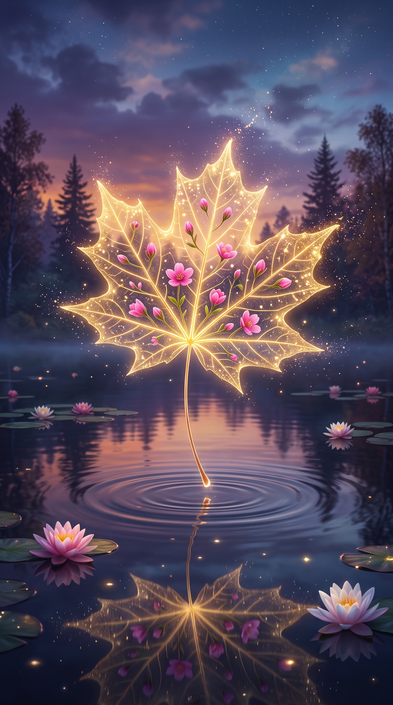

# Glowing Maple Leaf Touching Still Water

**中文标题：** 枫叶点水 Prompt1  
**ID:** `gi25-x-609` · **Mode:** `generate`  
**Categories:** `general`  
**Tags:** `x-twitter`, `community`, `gpt-image-2.5`, `xianyu`, `en`



### Glowing Maple Leaf Touching Still Water

```text
An enchanting and surreal digital art piece featuring a translucent, golden maple leaf hovering magically above the surface of calm, dark water. The leaf glows from within with a warm, ethereal light, its delicate veins clearly visible. Inside the translucent structure of the leaf, tiny, vibrant pink flowers and closed buds are embedded, appearing to bloom within its very veins. The tips of the leaf are edged with a sparkling, golden glitter that drifts into the air like magic dust. The leaf's stem extends downward, just touching the water's surface, creating concentric ripples that spread outward. Below the water, a reflection of the glowing leaf and stem is faintly visible. The background is a dreamy twilight forest with silhouetted pine trees against a soft, gradient sky of purple, orange, and blue. Several pink water lilies float on the dark water, adding to the serene and magical atmosphere.
```

- **Recommended model:** `gpt-image-2.5-flare`
- **Settings:** _(defaults)_
- **Source:** [community](https://x.com/churvikv/status/2097784050660376617) — @churvikv (via xianyu110/awesome-gpt-image2.5)
- **License note:** Community X post mirrored in xianyu110/awesome-gpt-image2.5; remix with attribution
- **Notes:** xianyu110 case 2097784050660376617; category=场景视觉; verified=True
- **Preview:** `previews/gi25-x-609.jpg`
