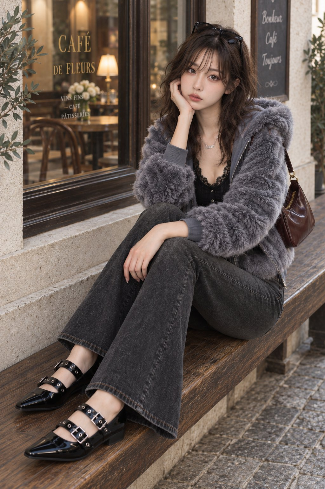

# Protected-Wardrobe Long Outfit Prompt Pack

**中文标题：** 可互换长文衣装 Prompt 包  
**ID:** `gi25-x-612` · **Mode:** `edit`  
**Categories:** `general`, `edit-change-preserve`  
**Tags:** `x-twitter`, `community`, `gpt-image-2.5`, `xianyu`, `en`



### Protected-Wardrobe Long Outfit Prompt Pack

```text
PROTECTED WARDROBE RULE — HIGHEST PRIORITY: Treat each garment description below as its immutable final product identity. Preserve construction, parts, hardware, material, pattern, and every registered graphic or marking—its surface, side, orientation, scale, colors, content, spelling, and count. FINAL WORN STATE overrides only the scoped item's use, position, side, orientation, fastening, layering, folds, tucks, knots, and drape. A SOURCE GARMENT label describes the unstyled item, never the completed silhouette. Do not redesign, add, remove, mirror, duplicate, relocate, or redraw protected details.

Wardrobe:

Outerwear / layers:

A waist-length hooded jacket with a roomy, softly rounded body and full-length voluminous sleeves, made in dense chestnut-blue gray faux fur. The lustrous pile forms small irregular swirls and rippling tufts, with slate gray depths between warmer blue gray fiber tips. A generous attached hood has a thick fur-covered rim and a center-back seam. A two-way silver-tone zipper closes the full front, while smooth blue gray lining covers the interior and hood. Blue gray rib-knit cuffs and a broad matching waistband draw in the plush shell; concealed side-seam pockets and a matching fur back complete the jacket.

Final worn state:
- Layering: Final state: keep this garment the complete outer layer over the selected Top item; open only its original center-front fastening run within existing endpoints. Preserve source neckline, collar, front/rear panels, selected shoulder, sleeve, and body positions, plus fastening inventory, receiver mapping, order, spacing, endpoints, and placket length; add, remove, move, or extend nothing. FINAL FASTENING STATE: change only the source-registered primary closure mechanism inside its exact original endpoints. Preserve that mechanism, all original parts, its source length, and the garment construction beyond both endpoints; do not reinterpret a seam, fold, rib, placket, or panel edge as an extension, and add, duplicate, remove, or relocate nothing. Only layer order, contact, occlusion, and optical transmission change. Every visible garment boundary follows the outer item's source geometry or separately selected fold-return line; inner contours remain optically behind it. Keep panel contact shallow. Relaxed handling within this same operation: Use light stable contact and broader material-correct ease without changing the selected layer order.

Top: A fitted black cardigan ending at the high hip, in fine, lightweight vertical rib knit with narrow semi-sheer channels between the ribs. Short fitted set-in sleeves and a matching ribbed back continue the close silhouette. A deep rounded V-neckline is framed by broad black floral lace, which continues down both edges of the full button front to the lower hem. Large flower heads, curling leaves and fine mesh fill the lace bands, with delicate eyelash loops extending from their free edges. Small black four-hole buttons close the front, and a narrow knitted hem finishes the body and sleeves.

Upper-body innerwear: A simple black stretch-jersey bandeau with a broad opaque band covering the bust, a gently curved upper edge and a straight lower edge ending above the waist. Soft matte fabric, discreet enclosed elastic along both edges and smooth side seams create a close, flexible fit, with a continuous plain back and no straps or visible hardware.

Bottom: A pair of full-length flared jeans in washed charcoal-black denim, with a low-to-mid-rise waist, fitted hips and thighs, and legs that narrow toward the knees before widening into broad bootcut hems. Soft gray fading runs over the front hips and thighs, with subtle whiskering beneath the waistband and fine vertical denim grain throughout. Muted tan-gray double topstitching defines the curved front pockets, coin pocket, fly and seams. Belt loops, a button-and-zip closure, a rear yoke, two plain rear patch pockets and flat stitched hems complete the five-pocket construction.

Footwear: A pair of black patent-leather shoes with long tapered toes ending in short squared tips, low side quarters and enclosed heels. Two separate glossy straps cross each open instep on a slight diagonal, each threaded through a silver-tone rectangular buckle on the outer side and punctuated by large round silver eyelets. The smooth pointed toe panels and patent side sections frame the open areas beneath and between the straps. Dark lining, slim black rubber soles with a lightly projecting beveled edge and low block heels complete the pair.

Bag:

A low, elongated shoulder bag in deep wine-brown leather with a glossy finish, subtle tonal variation and soft natural creasing. The supple body has gently rounded lower corners, shallow side and base gussets, piped perimeter seams and raised ends flanking a softly concave top opening. A fine gold-tone zipper follows the curved upper edge. One narrow matching leather shoulder strap has stitched edges, a small adjustment buckle and gold-tone circular rings with swivel-snap attachments at the bag ends. The rear is plain matching leather, and dark wine-colored textile lines the interior.

Final worn state:
VIEW-CONDITIONAL BODY-SIDE MAP: front view — wearer-left is image-right and wearer-right is image-left; back view — wearer-left is image-left and wearer-right is image-right. In profiles, crossed limbs, or ambiguity, trace the named anatomical side continuously from its corresponding shoulder, hip, eye, or ear landmark as applicable. Apply the state only to the named anatomical side; never mirror, swap, or duplicate it.
- Bag carry: Final state: the registered short strap bears weight from the wearer-left shoulder; the bag top sits directly beneath the wearer-left armpit against the wearer-left side torso. Both hands stay off; support never moves to the wearer-left forearm, elbow, wrist, or hand. Keep registered supports and components connected; allow contact and gravity-led ease only along the selected route. Natural handling within this same operation: Keep the selected support point exact while allowing limited natural contact variation and one small gravity-led angle.

Belt:

A broad black leather belt with a smooth, softly lustrous surface and clean edges, fastened by an oversized polished silver-tone buckle. The buckle forms an asymmetric swept D-shaped frame: a thick, rounded crescent broadens along the outer curve, with a second flowing ridge following its contour and tapering toward the strap attachment. A silver prong crosses the dark central opening to engage the belt holes. A matching black keeper and a rounded strap end complete the adjustable belt.

Final worn state:
- Belt placement: Place the complete belt horizontally around the outside of the selected Bottom item at the wearer's anatomical natural waist. Do not move it to the hips or ribcage; preserve the separately selected routing, buckle position, and tail treatment. Keep the selected position and fastening state; change only contact pressure and physically available ease. Natural handling within this same operation: Keep the registered fastening secure and use light stable contact with a small amount of material-correct ease distributed around the complete belt circuit.
- Buckle position: Center the single existing buckle on the wearer's anatomical front midline and fasten it using only its registered closure mechanism. For a frame-and-prong buckle only, pass the existing prong through exactly one existing hole and seat the strap against the frame; for a ratchet, clasp, plate, or automatic buckle, engage only its registered mechanism. Do not invent a hole, prong, or closure part, and preserve the separately selected height, routing, and tail treatment.

Eyewear:

A pair of slim black sunglasses with low, horizontally elongated rectangular lenses, softly rounded corners and a subtle lift at the outer edges. Glossy full rims surround smoky gray-brown lenses, joined by a narrow molded bridge with integral nose rests. The gently curved front connects through small hinges to slender tapered black temples with inward-curving ear tips. The frame is smooth and unornamented.

Final worn state:
- Eyewear placement: Final state: rest the open registered eyewear on the outer surface of the hair at the crown like a headband, with both lenses level and facing forward, the bridge centered on the head midline, and both temple arms open along the sides of the head. Do not place the eyewear on the face, neckline, chest, or garment.

Necklace: A delicate silver-tone necklace with a fine short chain and a compact openwork "Lune" pendant, with a tall serif L at the left and smaller joined lowercase u, n and e stepping gently across its lower half; the polished silver strokes merge at their contacts while preserving open letter interiors. Small connections at the ornament's opposite upper sides suspend it centrally, with a smooth flat reverse and clean polished edges. The chain closes behind the neck with a small lobster clasp and a short matching extension chain.

Navel piercing:

A silver-tone curved navel barbell with two clear round stones set vertically, a small upper stone and a larger lower stone. Smooth polished rims surround the faceted stones, joined by a short gently curved metal bar. A discreet screw-on upper terminal and rounded setting backs complete the piercing.

Final worn state:
- Piercing count and arrangement: Wear the navel piercing in a floating placement through the upper fold, keeping the flat inner end inside the hollow and only the outer decoration visible.
```

- **Recommended model:** `gpt-image-2.5-sunburst`
- **Settings:** _(defaults)_
- **Source:** [community](https://x.com/MoodLock_JP/status/2097653761569423653) — @MoodLock_JP (via xianyu110/awesome-gpt-image2.5)
- **License note:** Community X post mirrored in xianyu110/awesome-gpt-image2.5; remix with attribution
- **Notes:** xianyu110 case 2097653761569423653; category=人像角色; verified=True
- **Preview:** `previews/gi25-x-612.jpg`
