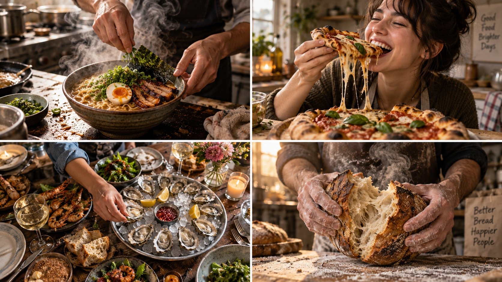

# Modular Viral Food Shot Prompt (2×2 Grid)

**中文标题：** 模块化美食病毒图  
**ID:** `gi25-x-613` · **Mode:** `generate`  
**Categories:** `general`  
**Tags:** `x-twitter`, `community`, `gpt-image-2.5`, `xianyu`, `en`



### Modular Viral Food Shot Prompt (2×2 Grid)

```text
2x2 grid, 16:9, do this for 4 clever viral subjects: INPUT ::= PERSONA_SEED + CUISINE_LANE + FRAME_TYPE    TASTE_1 :: read the cuisine  - what the cooking does to the room: wok steam, flour dust, smoke curl, citrus mist  - the hero texture of this lane: pull, crackle, drip, char, lamination  - honest kitchen evidence: sauce-splashed stove, stained apron, knife mid-board  - hands tell the résumé: small burn scars, practiced grip, flour in the nail beds    TASTE_2 :: read the frame type  - POV hands = 35mm overhead-diagonal, persona's hands + forearms only, dish 60% of frame  - portrait-with-dish = 50mm, persona mid-laugh or mid-taste, dish lifted into shared focus  - tablescape = 24mm slightly high, persona reaching in from the edge, abundance sprawl    APPETITE :: physics of delicious  - steam needs backlight to exist — place the window or lamp behind the food  - glisten on fats, matte on breads, condensation on cold glass  - controlled mess: a torn edge, a drip caught mid-run; sterile plates kill hunger  - persona's reaction is the seasoning: eyes on the food, never on the camera    STAGE :: warm frame  - 4:5, shallow depth (f/2.2), warm-neutral grade, no orange oversaturation  - kitchen or table is mid-use, not styled dead  - the unforgettable feature survives the crop even in the POV hands variant    BAR :: the viewer's mouth reacts before their brain does, and the hands could plausibly have cooked this for ten years
```

- **Recommended model:** `gpt-image-2.5-sunburst`
- **Settings:** _(defaults)_
- **Source:** [community](https://x.com/Gdgtify/status/2097620275940737326) — @Gdgtify (via xianyu110/awesome-gpt-image2.5)
- **License note:** Community X post mirrored in xianyu110/awesome-gpt-image2.5; remix with attribution
- **Notes:** xianyu110 case 2097620275940737326; category=场景视觉; verified=True
- **Preview:** `previews/gi25-x-613.jpg`
