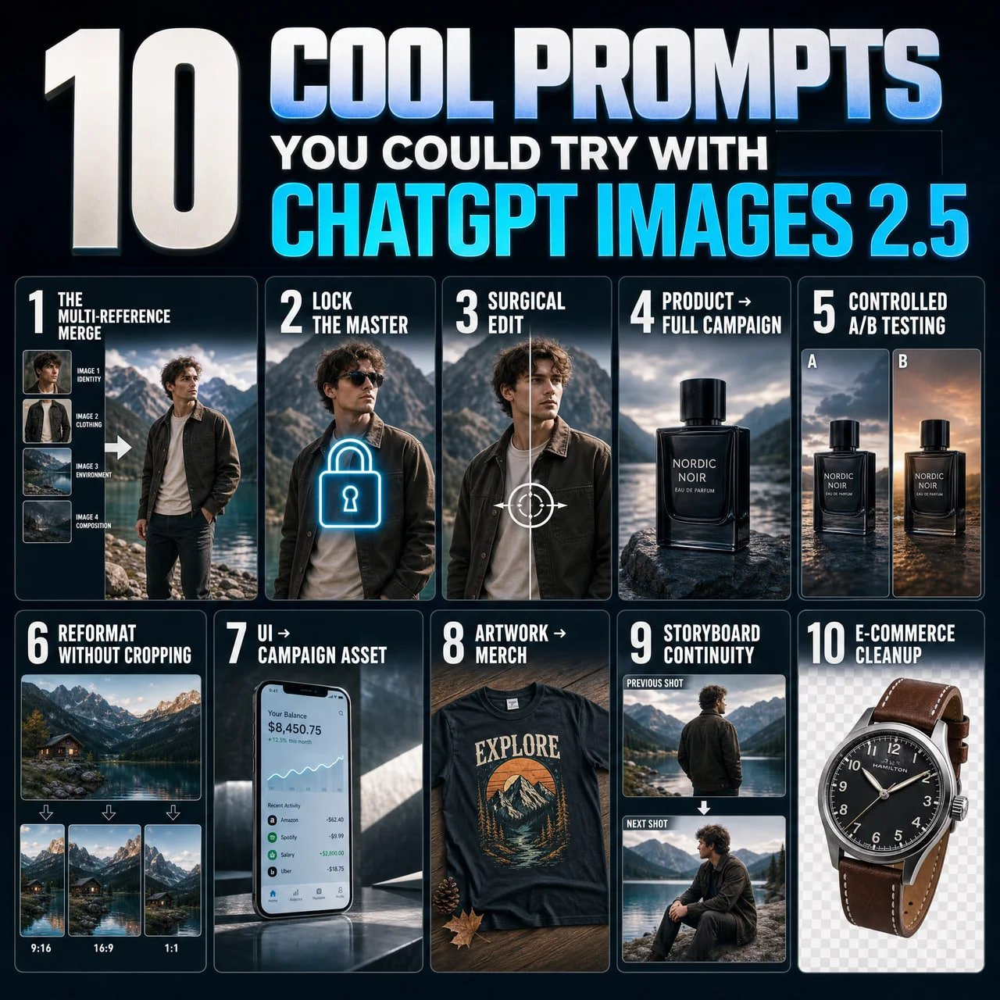

# 10 Control-Focused Images 2.5 Prompts

**中文标题：** 10 条 Control / Astra 向 Prompt  
**ID:** `gi25-x-614` · **Mode:** `edit`  
**Categories:** `general`, `edit-change-preserve`  
**Tags:** `x-twitter`, `community`, `gpt-image-2.5`, `xianyu`, `en`



### 10 Control-Focused Images 2.5 Prompts

```text
1. The multi-reference merge.
“Image 1 = identity. Image 2 = clothing. Image 3 = environment. Image 4 = composition. Use each only for its assigned role. Combine into one coherent photorealistic scene.”

2. Lock the master.
“This image is the approved master. Treat every visible attribute as locked unless I explicitly name it. For future edits, change only the requested variable and preserve everything else.”

3. Surgical edit.
“Change ONLY [ELEMENT/REGION]. Match existing anatomy, materials, lighting, and perspective. Do not modify anything else.”

4. Product → full campaign.
“Treat image 1 as the immutable product reference. Preserve exact geometry, materials, colors, and branding. Place it in [SCENE]. Change only environment, lighting, and camera.”

5. Controlled A/B testing.
“Create [N] variants of this creative. Preserve product, composition, typography, and lighting. Change ONLY [VARIABLE]. Everything else stays locked.”

6. Reformat without cropping.
“Recompose this exact image for [ASPECT RATIO]. Do not simply crop it. Preserve the subject and visual hierarchy while intelligently extending and rearranging the scene.”

7. UI → campaign asset.
“Treat the uploaded UI as locked artwork. Do not redesign it. Place it accurately inside a premium [DEVICE/CAMPAIGN] scene with realistic lighting, reflections, and negative space.”

8. Artwork → merch.
“Treat image 1 as the exact artwork. Preserve composition and colors. Apply it realistically to [PRODUCT], following folds, texture, and print behavior. Do not redesign it.”

9. Storyboard continuity.
“Treat this image as the canonical character, wardrobe, and location. Generate the next shot: [SHOT]. Change only camera, framing, and pose. Preserve everything else.”

10. E-commerce cleanup.
“Preserve the product exactly. Remove the environment and isolate it on [BACKGROUND/TRANSPARENT]. Repair only edge details for a clean catalog image. Do not alter color, branding, or proportions.”
```

- **Recommended model:** `gpt-image-2.5-sunburst`
- **Settings:** _(defaults)_
- **Source:** [community](https://x.com/vinsonleow/status/2097592608583471184) — @vinsonleow (via xianyu110/awesome-gpt-image2.5)
- **License note:** Community X post mirrored in xianyu110/awesome-gpt-image2.5; remix with attribution
- **Notes:** xianyu110 case 2097592608583471184; category=场景视觉; verified=True
- **Preview:** `previews/gi25-x-614.jpg`
