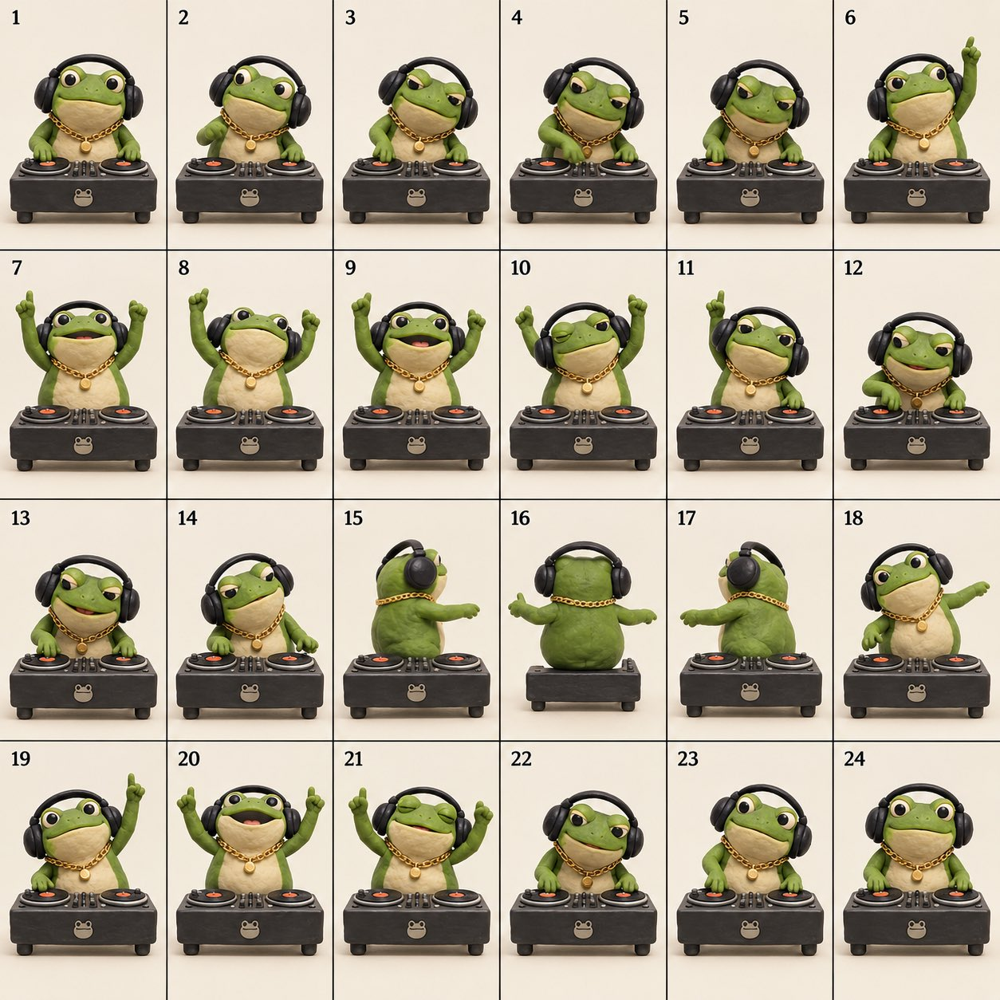

# Clay Stop-Motion Frog DJ Loop

**中文标题：** 粘土定格 GIF：胖青蛙 DJ 一次出循环  
**ID:** `gi25-x-616` · **Mode:** `generate`  
**Categories:** `general`  
**Tags:** `x-twitter`, `community`, `gpt-image-2.5`, `xianyu`, `en`



### Clay Stop-Motion Frog DJ Loop

```text
Create a 24-frame clay stop-motion loop of a chubby green frog DJing. Handmade plasticine texture, tiny gold chain, oversized black headphones, one hand on the turntable. The frog bobs its head, scratches the record, throws both arms up, spins once, and loops back. Square 1:1, solid off-white background, full character always visible, no cropped limbs/headphones/tables, no frame leakage, only a subtle horizontal ground shadow. Slightly choppy handcrafted motion, not smooth CGI.
```

- **Recommended model:** `gpt-image-2.5-sunburst`
- **Settings:** _(defaults)_
- **Source:** [community](https://x.com/MrDasCreates/status/2098360111597244532) — @MrDasCreates (via xianyu110/awesome-gpt-image2.5)
- **License note:** Community X post mirrored in xianyu110/awesome-gpt-image2.5; remix with attribution
- **Notes:** xianyu110 case 2098360111597244532; category=像素动效; verified=True; handle renamed since mirroring (was @MrDasOnX)
- **Preview:** `previews/gi25-x-616.jpg`
