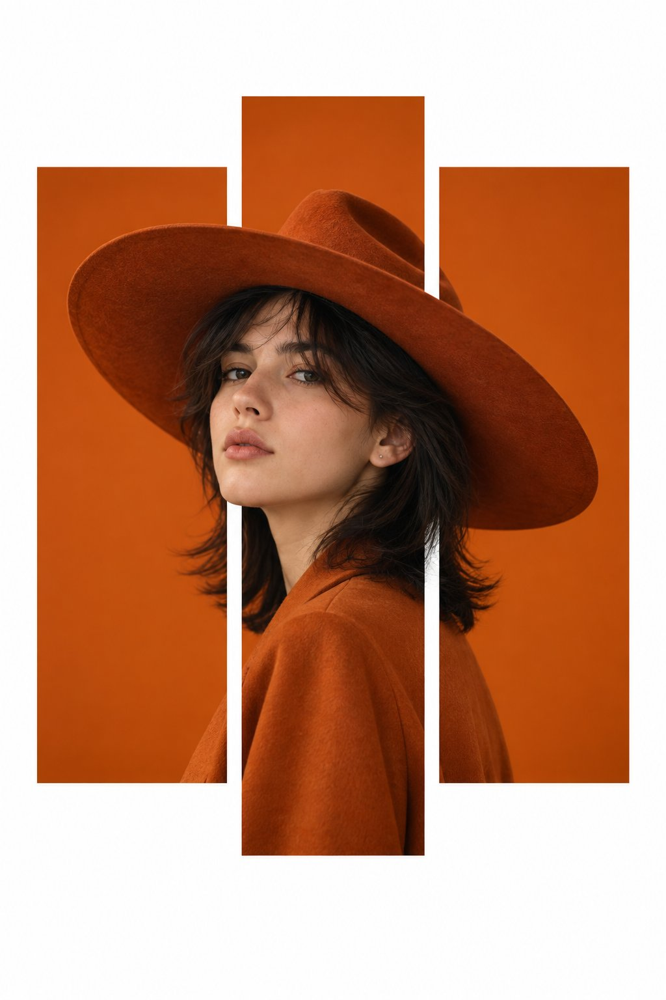

# Orange Panels Fashion Editorial

**中文标题：** 橙色竖面板时装海报  
**ID:** `gi25-x-619` · **Mode:** `generate`  
**Categories:** `general`, `poster-typography`  
**Tags:** `x-twitter`, `community`, `gpt-image-2.5`, `bravoneo`, `en`



### Orange Panels Fashion Editorial

```text
Create a vertical 2:3 fashion editorial poster with a minimalist, modern aesthetic. Use a clean white background with three tall, rectangular orange panels arranged vertically across the center, with narrow white gaps between them. The middle panel is slightly taller than the two outer panels.

Feature a realistic young woman with fair skin, delicate facial features, and light brown hair styled neatly under a large, wide-brimmed burnt-orange cowboy hat. She wears an elegant burnt-orange long-sleeve blouse with soft folds and a refined fashion-forward look.

Position the woman in a three-quarter profile, facing slightly toward the camera with a calm, confident expression. Her head and oversized hat extend across all three orange panels, while her body is primarily visible through the center panel. The orange panels should create a striking cutout effect, with parts of the portrait appearing to overlap the panel edges.

Use warm studio lighting, soft natural skin texture, subtle shadows, crisp edges, high-end fashion photography, balanced negative space, and a premium contemporary magazine design. Use a monochromatic burnt-orange color palette against a pure white background.

No text, no logos, no typography, no borders, no extra objects. Focus entirely on the woman, the oversized hat, and the geometric orange panel composition.
```

- **Recommended model:** `gpt-image-2.5-sunburst`
- **Settings:** _(defaults)_
- **Source:** [community](https://x.com/harboriis/status/2099350017844867510) — @harboriis (via BravoNeo/awesome-gpt-image-2-5-prompts)
- **License note:** Original X post credited via BravoNeo/awesome-gpt-image-2-5-prompts (third-party source, no new license granted); remix with attribution
- **Notes:** BravoNeo entry x-2099350017844867510; use=fashion-editorial,posters; style=photorealistic,minimalist,graphic-design; prompt matches original X post text; verified=True
- **Preview:** `previews/gi25-x-619.jpg`
