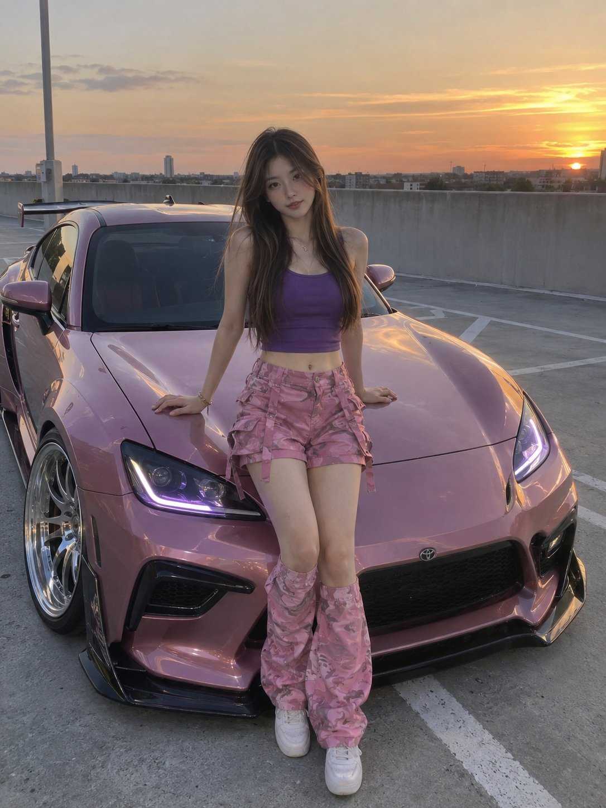

# Sunset Parking-Garage Car Portrait

**中文标题：** 日落停车场汽车人像  
**ID:** `gi25-x-621` · **Mode:** `generate`  
**Categories:** `general`  
**Tags:** `x-twitter`, `community`, `gpt-image-2.5`, `bravoneo`, `en`



### Sunset Parking-Garage Car Portrait

```text
ULTRA-REALISTIC NATURAL SMARTPHONE PHOTOGRAPH, vertical 3:4, candid sunset automotive lifestyle portrait of a young East Asian woman posing beside a customized modern sports coupe on the top level of an open-air parking garage.
She has long, straight dark-brown hair with subtle lighter brown highlights, naturally parted in the center and falling over her shoulders. She has delicate youthful features, realistic clear skin, minimal natural makeup, and a calm confident expression while looking directly at the camera.
She is wearing a fitted purple sleeveless cropped tank top, high-waisted bright pink cargo-style shorts with multiple pockets and strap details, and matching loose pink patterned thigh-high leg warmers or oversized leg sleeves. She finishes the outfit with clean white low-top sneakers and minimal jewelry.
She stands directly in front of the car with a relaxed confident pose, both hands resting naturally on the front hood of the vehicle, shoulders relaxed, feet positioned casually apart. The pose should feel like an authentic spontaneous car-meet photograph rather than a professional advertisement.
The car is a low, aggressively styled modern Japanese-inspired sports coupe finished in a distinctive metallic dusty-rose/pink color. It has a wide aerodynamic body kit, black front grille, sharp sculpted headlights with subtle purple illumination, large polished multi-spoke alloy wheels, dark tinted windows, a prominent rear wing, and realistic glossy reflections across the bodywork.
The scene takes place on an elevated rooftop parking deck during sunset. A low concrete perimeter wall runs behind the car, with a distant flat city horizon visible above it. The sky transitions naturally from warm golden-orange near the horizon into soft pale blue-gray higher up, with the last sunlight reflecting across the car's metallic paint.
Authentic RAW smartphone photography, realistic human skin texture, individual hair strands, accurate hands and fingers, natural body proportions, realistic clothing folds, detailed automotive surfaces, physically accurate reflections, subtle lens softness, slight smartphone exposure imperfections, natural shadows, realistic sunset lighting, no beauty filter, no plastic skin, no CGI appearance, no excessive retouching, no commercial car-ad look, candid street photography aesthetic, highly detailed, vertical 3:4 composition.
```

- **Recommended model:** `gpt-image-2.5-sunburst`
- **Settings:** _(defaults)_
- **Source:** [community](https://x.com/saniaspeaks_/status/2100794581327732765) — @saniaspeaks_ (via BravoNeo/awesome-gpt-image-2-5-prompts)
- **License note:** Original X post credited via BravoNeo/awesome-gpt-image-2-5-prompts (third-party source, no new license granted); remix with attribution
- **Notes:** BravoNeo entry x-2100794581327732765; use=portraits,fashion-editorial; style=photorealistic; prompt matches original X post text; verified=True
- **Preview:** `previews/gi25-x-621.jpg`
