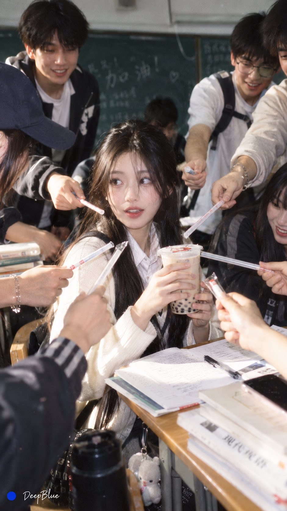

# Classroom Milk Tea and Helpful Classmates

**中文标题：** 课室奶茶与递吸管群像  
**ID:** `gi25-x-623` · **Mode:** `generate`  
**Categories:** `general`  
**Tags:** `x-twitter`, `community`, `gpt-image-2.5`, `bravoneo`, `zh`



### Classroom Milk Tea and Helpful Classmates

```text
大学课室 × 班花刚拿奶茶 × 众人递吸管 × 《西西里的美丽传说》群体互动构图 × iPhone抓拍 × CCD胶片感

说明：
班花刚拿到封口奶茶，尚未插入吸管；周围同学自然地从不同方向递来吸管，人物动作自然错落、彼此略有重叠。借用《西西里的美丽传说》经典点烟场面的“明确需求信号 → 周围人物即时回应”逻辑，通过普通大学课室与过度热情的服务行为形成反差。
```

- **Recommended model:** `gpt-image-2.5-sunburst`
- **Settings:** _(defaults)_
- **Source:** [community](https://x.com/DeepBlueX0/status/2102804230948126802) — @DeepBlueX0 (via BravoNeo/awesome-gpt-image-2-5-prompts)
- **License note:** Original X post credited via BravoNeo/awesome-gpt-image-2-5-prompts (third-party source, no new license granted); remix with attribution
- **Notes:** BravoNeo entry x-2102804230948126802; use=portraits; style=photorealistic,film; prompt matches original X post text; verified=True
- **Preview:** `previews/gi25-x-623.jpg`
