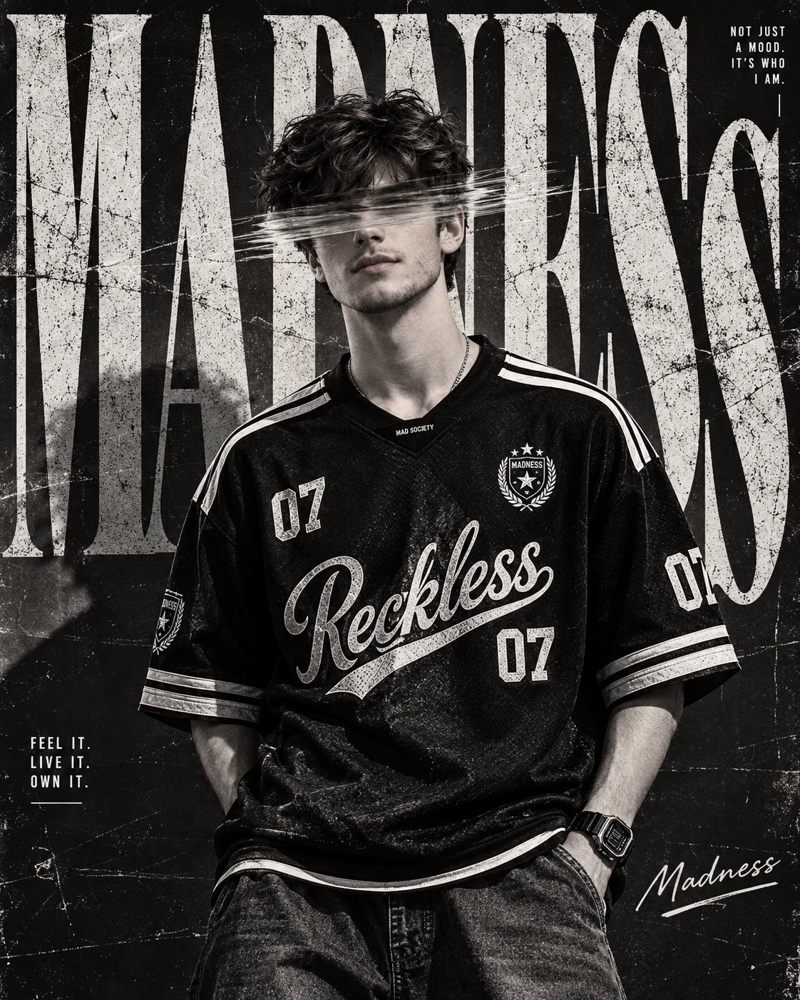

# Madness Monochrome Fashion Poster

**中文标题：** MADNESS黑白时装海报  
**ID:** `gi25-x-629` · **Mode:** `generate`  
**Categories:** `general`, `poster-typography`  
**Tags:** `x-twitter`, `community`, `gpt-image-2.5`, `bravoneo`, `en`



### Madness Monochrome Fashion Poster

```text
Create a high-end monochrome fashion editorial poster featuring a young male model standing confidently in the center of the frame.

SUBJECT AND POSE:
A young man with thick, naturally curly dark hair, medium-length curls with strong volume. He has a clean youthful face with subtle facial hair and a relaxed, confident expression. He stands facing the camera with his body slightly angled, shoulders relaxed, both hands casually placed inside the front pockets of his loose-fitting pants. His posture feels effortless and confident.

He wears an oversized black vintage-inspired football jersey with white athletic stripes running along both shoulders and sleeves. The jersey has a large stylized script graphic reading "Reckless 07" across the chest, smaller "07" numbers on the upper chest and sleeves, a small crest emblem on the left chest, and subtle athletic branding details. Pair it with loose dark denim jeans.

Add a chunky digital wristwatch on his left wrist and a simple thin chain around his neck.

FACE OBSCURATION:
Create a strong horizontal motion-blur/glitch effect passing directly across the model's eyes. The effect should look like several translucent horizontal photographic brush streaks or smeared film frames moving rapidly from left to right. Keep the rest of the face sharp and recognizable. Do not cover the entire face.

COMPOSITION:
Vertical fashion poster composition, approximately 4:5 aspect ratio.

The model occupies most of the center and lower-middle portion of the poster. Frame him from approximately the knees upward. Keep his entire hairstyle visible with enough negative space around the head.

Behind him, create an oversized editorial typographic background with huge distressed white letters spelling "MADNESS". The typography should extend beyond the edges of the poster and sit behind the model, creating a layered magazine-cover effect.

The giant letters should have a weathered, scratched, cracked and slightly faded texture.

GRAPHIC DESIGN:
Add small editorial typography around the composition.

Top-right:
"NOT JUST
A MOOD.
IT'S WHO
I AM."

Bottom-left:
"FEEL IT.
LIVE IT.
OWN IT."

Bottom-right:
A handwritten-style signature reading "Madness" with a rough underline.

Use small thin lines and subtle geometric graphic marks around the typography.

COLOR AND LIGHTING:
Strict black-and-white monochrome photography.

Deep black background, bright off-white typography, high contrast subject, strong shadows, slightly crushed blacks and bright highlights. No colorful elements.

Use dramatic studio/editorial lighting with directional light from the front and slightly above, creating sculpted facial features and strong texture on the clothing.

STYLE:
Luxury streetwear campaign mixed with underground football culture, vintage sports editorial, rebellious youth fashion magazine, gritty urban poster design.

Add heavy analog film grain, photocopy texture, distressed paper texture, scratches, dust particles, subtle cracks, rough halftone details, faded ink, imperfect printing, and subtle photographic noise.

The final image should feel like a scanned vintage fashion magazine poster that has been repeatedly photocopied and physically distressed.

TYPOGRAPHY:
Use bold condensed serif typography for the enormous background word "MADNESS".

Use elegant handwritten script typography for "Reckless 07" across the jersey and the "Madness" signature.

Keep all typography sharp, intentional, and professionally integrated into the composition.

OVERALL MOOD:
Dark, rebellious, youthful, confident, raw, mysterious, underground and fashion-forward.

High-end editorial photography, vintage football jersey campaign, gritty monochrome magazine cover, sophisticated graphic design, realistic photographic details, 4K quality, extremely detailed fabric texture, authentic film grain, professional poster composition.
```

- **Recommended model:** `gpt-image-2.5-sunburst`
- **Settings:** _(defaults)_
- **Source:** [community](https://x.com/harboriis/status/2103442969952952761) — @harboriis (via BravoNeo/awesome-gpt-image-2-5-prompts)
- **License note:** Original X post credited via BravoNeo/awesome-gpt-image-2-5-prompts (third-party source, no new license granted); remix with attribution
- **Notes:** BravoNeo entry x-2103442969952952761; use=fashion-editorial,posters; style=monochrome,film,graphic-design; prompt matches original X post text; verified=True
- **Preview:** `previews/gi25-x-629.jpg`
