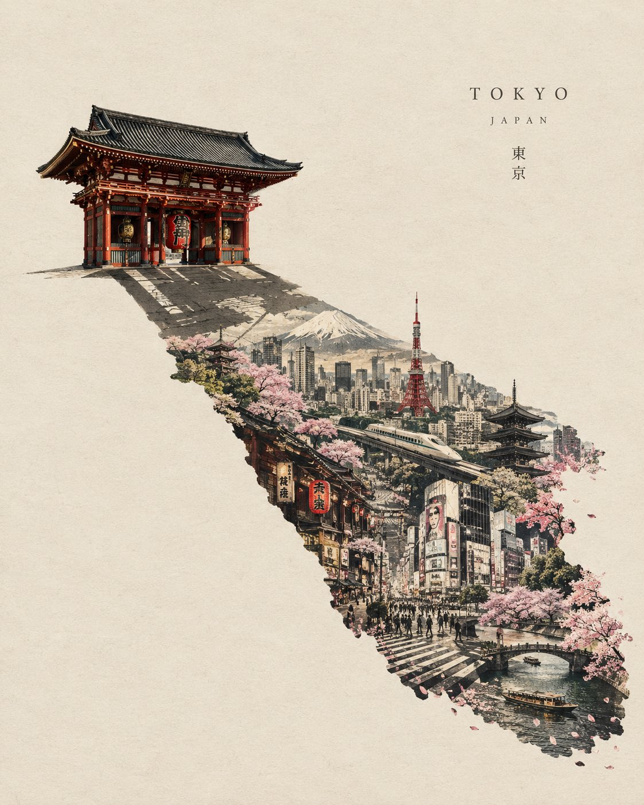

# The World Inside a Shadow

**中文标题：** 影子里的世界  
**ID:** `gi25-x-632` · **Mode:** `generate`  
**Categories:** `general`, `poster-typography`  
**Tags:** `x-twitter`, `community`, `gpt-image-2.5`, `bravoneo`, `en`



### The World Inside a Shadow

```text
Create a breathtaking, surreal editorial artwork based on [PERSON / LANDMARK / OBJECT / CITY], built around the concept “THE WORLD INSIDE A SHADOW.”

Show the main subject as a refined, almost museum-quality object or scene against a vast warm ivory paper background. The subject casts an unusually long, sharply defined shadow.

But instead of being empty, the shadow contains an entire hidden world connected to the subject.

Inside the shadow, reveal miniature scenes, architecture, landscapes, people, streets, memories, symbols, objects, and cultural details associated with [PERSON / LANDMARK / CITY / COUNTRY]. The shadow should feel like a secret parallel universe — as if the true story of the subject exists inside its silhouette.

The actual subject remains elegant, minimal, realistic and recognizable, while the shadow becomes increasingly detailed, surreal and dreamlike toward its farthest edge.

Create a seamless transition from realistic materials into delicate hand-drawn ink, architectural linework, tiny paper-cut elements, vintage engraving textures, subtle halftone dots and miniature painted details.

Use extreme visual storytelling and micro-details that reward close inspection.

Composition:

sophisticated editorial art direction
strong central silhouette
enormous flowing shadow extending diagonally across the canvas
generous negative space
visual hierarchy from simple subject → complex hidden world
no unnecessary objects
no clutter

Material language:
fine art paper, ink, graphite, engraved textures, subtle embossing, handmade print imperfections, delicate paper fibers, restrained collage elements.

Color palette:
warm ivory, charcoal, faded black, muted stone, dusty beige, with one controlled signature color inspired by [COUNTRY / CITY / SUBJECT].

Lighting:
soft museum lighting, subtle natural shadow, cinematic but understated.

Mood:
mysterious, intelligent, poetic, luxurious, slightly surreal, timeless.

Add extremely minimal typography:
[NAME]
small refined serif type placed away from the artwork, like a museum exhibition label.

No generic fantasy aesthetic, no excessive glow, no neon, no random decorative objects, no cheesy symbolism, no overcrowding.

4:5 vertical — premium contemporary art poster — museum exhibition quality — surreal editorial photography fused with handcrafted fine art — ultra-detailed — sophisticated and original.
```

- **Recommended model:** `gpt-image-2.5-sunburst`
- **Settings:** _(defaults)_
- **Source:** [community](https://x.com/Naiknelofar788/status/2103693304538038645) — @Naiknelofar788 (via BravoNeo/awesome-gpt-image-2-5-prompts)
- **License note:** Original X post credited via BravoNeo/awesome-gpt-image-2-5-prompts (third-party source, no new license granted); remix with attribution
- **Notes:** BravoNeo entry x-2103693304538038645; use=art-editorial,posters; style=surreal,minimalist; prompt matches original X post text; verified=True
- **Preview:** `previews/gi25-x-632.jpg`
