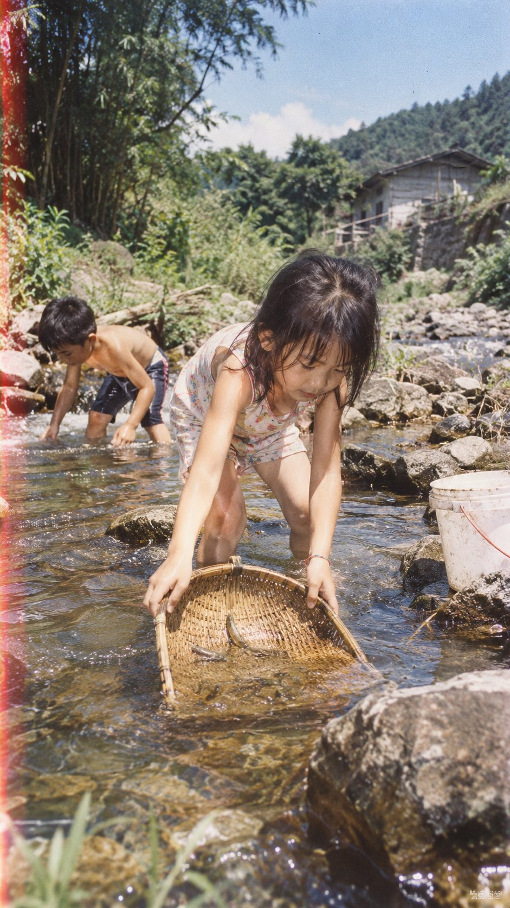

# 1990s Rural Childhood Film Photograph

**中文标题：** 九十年代乡野童年胶片照  
**ID:** `gi25-x-637` · **Mode:** `generate`  
**Categories:** `general`  
**Tags:** `x-twitter`, `community`, `gpt-image-2.5`, `bravoneo`, `zh`



### 1990s Rural Childhood Film Photograph

```text
90s中国家庭生活照 × 乡野童年生活 × 135胶片 × 【童年行为】

说明：
以90年代中国普通家庭记录孩子生活的照片为视觉语境，像家人随手拍下的一瞬间。人物自然玩耍、动作随意，不刻意摆拍；通过真实的生活环境、当时常见的生活物件和具体童年行为，唤起真实的童年记忆。保留135胶片家庭照片自然的影像特征与偶然性，重点表现“小时候真的发生过的一瞬间”，避免刻意复古、商业儿童写真和精心设计的怀旧摄影效果。竖版9:16。
```

- **Recommended model:** `gpt-image-2.5-sunburst`
- **Settings:** _(defaults)_
- **Source:** [community](https://x.com/DeepBlueX0/status/2104249785658294448) — @DeepBlueX0 (via BravoNeo/awesome-gpt-image-2-5-prompts)
- **License note:** Original X post credited via BravoNeo/awesome-gpt-image-2-5-prompts (third-party source, no new license granted); remix with attribution
- **Notes:** BravoNeo entry x-2104249785658294448; use=portraits; style=photorealistic,film; prompt matches original X post text; verified=True
- **Preview:** `previews/gi25-x-637.jpg`
